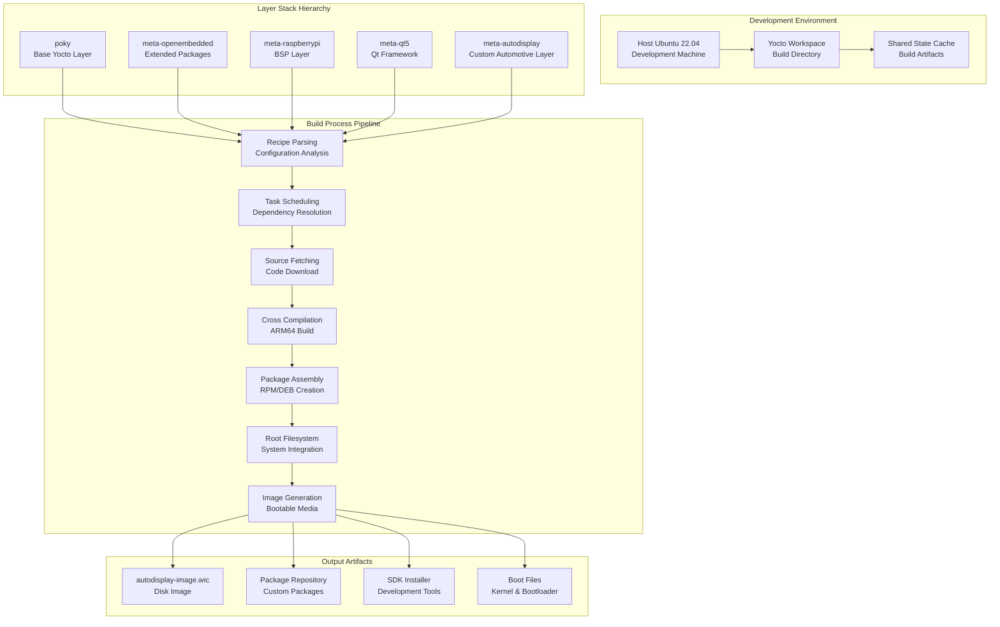
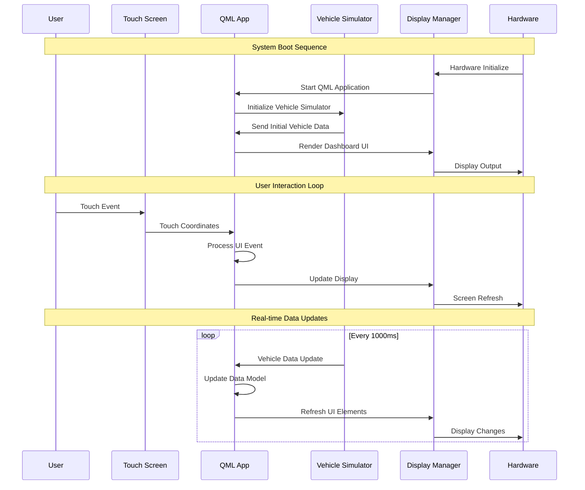
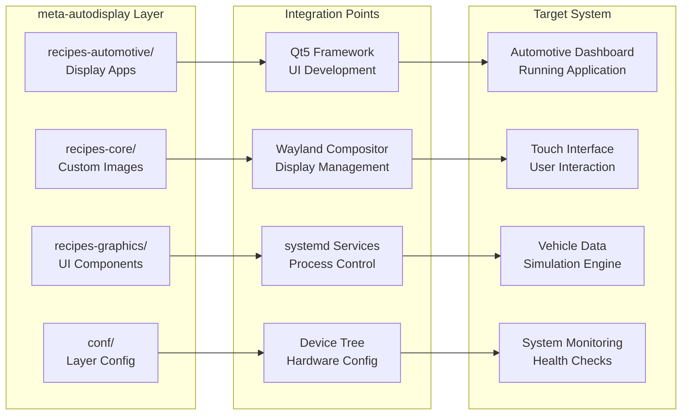
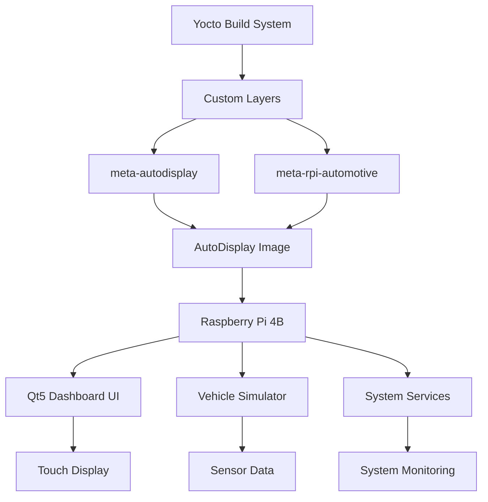
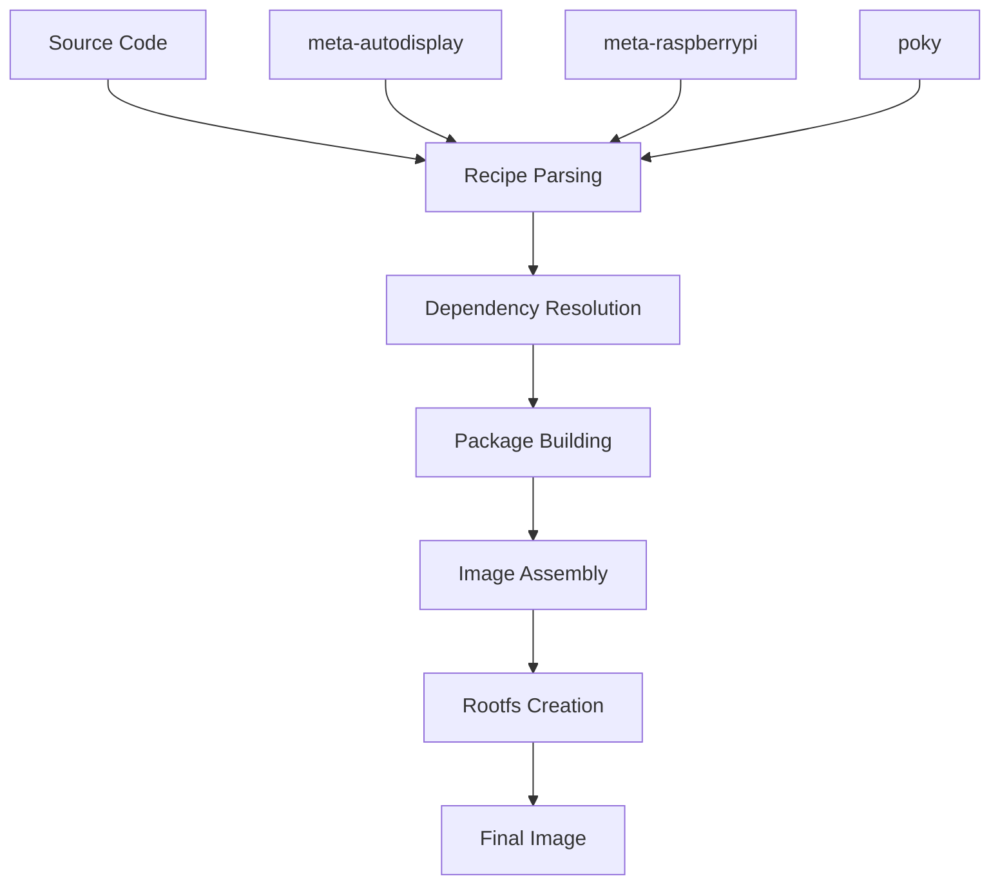
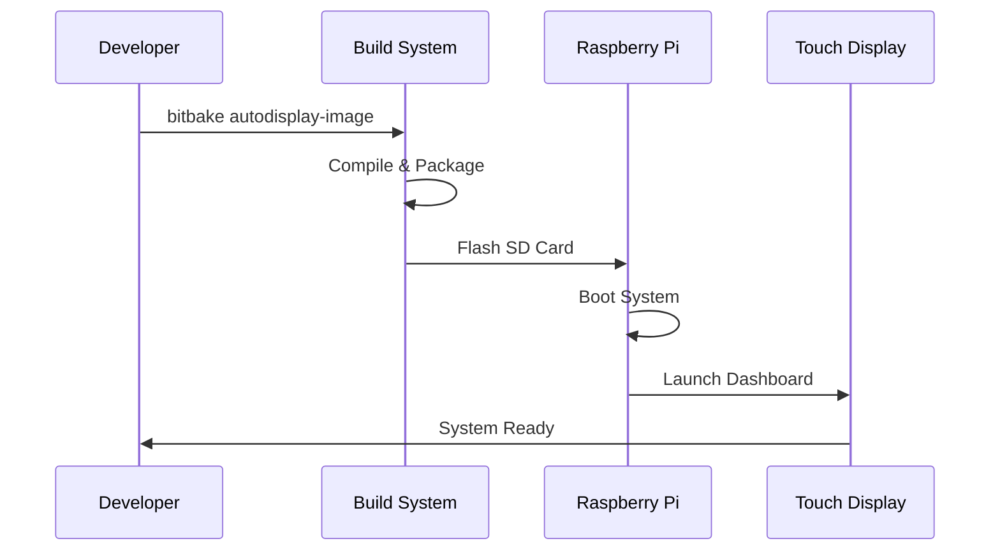

# Project 1: AutoDisplay-Yocto 🚗📱
## Beginner Level: Automotive Display System

[](https://github.com)
[](https://github.com)
[](https://github.com)
[](https://www.yoctoproject.org/)

> **Building a custom Yocto-based Linux system for automotive display applications with modern UI framework integration**

## 🎯 Project Overview

### Description
Create a custom embedded Linux distribution using Yocto Project for an automotive dashboard display system. This project demonstrates fundamental Yocto concepts including layer creation, recipe development, and custom image building while targeting a real-world automotive use case.

### Target Skill Level Justification
- **Beginner-friendly**: Focuses on core Yocto concepts without advanced customization
- **Foundation building**: Establishes understanding of build system and layer architecture  
- **Real-world relevance**: Automotive context provides industry application context
- **Scalable learning**: Concepts learned here apply to more complex projects

### Real-World Application Scenario
Modern vehicles require sophisticated display systems for:
- **Driver Information Display (DID)**: Speed, fuel, engine status
- **Infotainment Integration**: Basic media control and navigation
- **Vehicle Status Monitoring**: Diagnostics and maintenance alerts
- **User Interface**: Touch-friendly automotive-grade UI

### Learning Objectives (5 Specific Outcomes)
1. **Master Yocto Fundamentals**: Understand layers, recipes, and build system architecture
2. **Create Custom Layers**: Develop reusable layer structure following Yocto conventions
3. **Recipe Development**: Write and customize recipes for automotive applications
4. **Image Customization**: Build specialized Linux images with automotive-specific packages
5. **Cross-Platform Development**: Set up development environment for ARM-based automotive hardware

## 🔧 Technical Specifications

### Hardware Requirements
- **Primary Target**: Raspberry Pi 4B (4GB/8GB RAM)
- **Display**: 7" DSI touchscreen or HDMI display (1024x600 minimum)
- **Storage**: 32GB+ microSD card (Class 10 or better)
- **Development Host**: Ubuntu 22.04 LTS (minimum 8GB RAM, 100GB free space)
- **Optional**: BeagleBone Black for alternative platform testing

### Software Dependencies and Versions
```yaml
Yocto Project: Kirkstone (4.0 LTS)
Linux Kernel: 6.1 LTS
Build System: Bitbake 2.0
Host OS: Ubuntu 22.04 LTS
Python: 3.10+
Git: 2.34+
Cross-compilation: GCC 12.x
```

### Yocto Layer Structure and Custom Layers
```
meta-autodisplay/           # Main custom layer
├── conf/
│   └── layer.conf         # Layer configuration
├── recipes-automotive/     # Automotive-specific recipes
│   ├── display-manager/   # Custom display management
│   ├── vehicle-ui/        # Basic dashboard UI
│   └── diagnostics/       # Simple OBD-II integration
├── recipes-core/
│   └── images/           # Custom image recipes
└── recipes-kernel/
    └── linux/            # Kernel customizations

meta-rpi-automotive/        # BSP customization layer
├── conf/
│   └── layer.conf
└── recipes-bsp/
    └── bootfiles/        # Boot optimization for automotive
```

### Key Technologies and Protocols
- **UI Framework**: Qt5/QML for automotive-grade interface
- **Graphics**: Wayland compositor with automotive optimizations
- **Communication**: Basic GPIO for sensor simulation
- **Data Format**: JSON for configuration and status data
- **Build System**: Yocto/Bitbake with custom recipes
- **Version Control**: Git with proper branching strategy

## 🏗️ Layered System Architecture

### Application Stack Layers
```mermaid
graph TB
    subgraph "Application Layer"
        A1[AutoDisplay QML App<br/>Dashboard UI]
        A2[Touch Event Handler<br/>User Interaction]
        A3[Vehicle Data Controller<br/>Simulation Logic]
    end
    
    subgraph "Framework Layer"
        F1[Qt5/QML Runtime<br/>UI Framework]
        F2[Wayland Compositor<br/>Display Management]
        F3[Event System<br/>Input Processing]
    end
    
    subgraph "System Services Layer"
        S1[Vehicle Simulator<br/>Data Generation]
        S2[Display Manager<br/>Screen Control]
        S3[systemd Services<br/>Process Management]
    end
    
    subgraph "OS Middleware Layer"
        M1[D-Bus Message Bus<br/>IPC Communication]
        M2[udev Device Manager<br/>Hardware Events]
        M3[Kernel Modules<br/>Driver Interface]
    end
    
    subgraph "Linux Kernel Layer"
        K1[Process Scheduler<br/>Task Management]
        K2[Memory Manager<br/>Resource Allocation]
        K3[Device Drivers<br/>Hardware Interface]
        K4[File Systems<br/>Storage Access]
    end
    
    subgraph "Hardware Layer"
        H1[Raspberry Pi 4B<br/>ARM Cortex-A72]
        H2[7" Touch Display<br/>DSI Interface]
        H3[GPIO Pins<br/>Sensor Interface]
        H4[Storage & Network<br/>SD Card, WiFi]
    end
    
    A1 --> F1
    A2 --> F2
    A3 --> F3
    F1 --> S1
    F2 --> S2
    F3 --> S3
    S1 --> M1
    S2 --> M2
    S3 --> M3
    M1 --> K1
    M2 --> K2
    M3 --> K3
    K1 --> H1
    K2 --> H2
    K3 --> H3
    K4 --> H4
```

### Yocto Build System Architecture


### Runtime Data Flow Architecture


### Custom Layer Integration


## 🚀 Implementation Roadmap

### Phase 1: Environment Setup (Week 1, Days 1-3)
**Duration**: 3 days  
**Objective**: Establish development environment and Yocto build system

**Tasks**:
- Set up Ubuntu 22.04 development environment
- Install Yocto dependencies and tools
- Clone Poky repository (Kirkstone branch)
- Configure build environment and verify basic image build
- Set up cross-compilation toolchain

**Deliverables**:
- Functional Yocto build environment
- Successfully built `core-image-minimal` for Raspberry Pi
- Documentation of environment setup process

**Testing Checkpoints**:
- Verify bitbake command execution without errors
- Test basic image boot on Raspberry Pi hardware
- Validate cross-compilation toolchain functionality

### Phase 2: Custom Layer Creation (Week 1, Days 4-7)
**Duration**: 4 days  
**Objective**: Create foundational custom layers for automotive display system

**Tasks**:
- Create `meta-autodisplay` layer with proper structure
- Write layer.conf and establish dependencies
- Create basic automotive image recipe
- Set up recipe inheritance and package groups
- Implement version control structure

**Deliverables**:
- `meta-autodisplay` layer with complete structure
- Custom automotive image recipe (`autodisplay-image.bb`)
- Git repository with proper branching strategy
- Layer compatibility verification

**Testing Checkpoints**:
- Verify layer loads without conflicts
- Test custom image builds successfully
- Validate recipe parsing and dependency resolution

### Phase 3: UI Framework Integration (Week 2, Days 1-4)
**Duration**: 4 days  
**Objective**: Integrate Qt5/QML framework for automotive dashboard UI

**Tasks**:
- Create Qt5 integration recipes
- Design basic automotive dashboard interface
- Implement touch screen support and calibration
- Create vehicle status simulation framework
- Develop modular UI component architecture

**Deliverables**:
- Functional Qt5/QML dashboard application
- Touch screen calibration and input handling
- Basic vehicle data simulation system
- Professional UI mockups and wireframes

**Testing Checkpoints**:
- Dashboard launches and displays correctly
- Touch input responds appropriately
- Simulated vehicle data updates in real-time

### Phase 4: System Integration (Week 2, Days 5-7)
**Duration**: 3 days  
**Objective**: Complete system integration with automotive-specific optimizations

**Tasks**:
- Implement system service management
- Configure automatic application startup
- Add basic diagnostics and logging
- Optimize boot time for automotive requirements
- Create system monitoring and health checks

**Deliverables**:
- Fully integrated automotive display system
- Service management configuration
- Boot time optimization (target: <15 seconds)
- System health monitoring dashboard

**Testing Checkpoints**:
- System boots reliably and consistently
- All services start automatically
- Performance meets automotive timing requirements

### Phase 5: Documentation and Portfolio Preparation (Week 3)
**Duration**: 5-7 days  
**Objective**: Create comprehensive documentation and portfolio presentation

**Tasks**:
- Write detailed technical documentation
- Create architecture diagrams and flowcharts
- Produce demonstration video content
- Prepare GitHub repository for public presentation
- Develop LinkedIn content strategy

**Deliverables**:
- Professional README with installation guide
- Architecture documentation with Mermaid diagrams
- 10-minute demonstration video
- LinkedIn post series announcing project
- Resume-ready project description

**Testing Checkpoints**:
- Documentation allows independent project reproduction
- Video clearly demonstrates all features
- GitHub repository presents professionally

## 📋 Step-by-Step Execution Guide

### Environment Setup Commands
```bash
# 1. Install Yocto dependencies (Ubuntu 22.04)
sudo apt update && sudo apt install -y \
    gawk wget git diffstat unzip texinfo gcc build-essential \
    chrpath socat cpio python3 python3-pip python3-pexpect \
    xz-utils debianutils iputils-ping python3-git python3-jinja2 \
    libegl1-mesa libsdl1.2-dev python3-subunit mesa-common-dev \
    zstd liblz4-tool file locales

# 2. Set up Yocto workspace
mkdir ~/autodisplay-yocto && cd ~/autodisplay-yocto
git clone -b kirkstone git://git.yoctoproject.org/poky
cd poky
git clone -b kirkstone git://git.openembedded.org/meta-openembedded
git clone -b kirkstone git://git.yoctoproject.org/meta-raspberrypi

# 3. Initialize build environment
source oe-init-build-env build-autodisplay
```

### Custom Layer Creation
```bash
# Create custom layer structure
bitbake-layers create-layer ../meta-autodisplay
cd ../meta-autodisplay

# Layer configuration (conf/layer.conf)
cat > conf/layer.conf << 'EOF'
BBPATH .= ":${LAYERDIR}"
BBFILES += "${LAYERDIR}/recipes-*/*/*.bb \
            ${LAYERDIR}/recipes-*/*/*.bbappend"
BBFILE_COLLECTIONS += "autodisplay"
BBFILE_PATTERN_autodisplay = "^${LAYERDIR}/"
BBFILE_PRIORITY_autodisplay = "6"
LAYERDEPENDS_autodisplay = "core raspberrypi qt5-layer"
LAYERSERIES_COMPAT_autodisplay = "kirkstone"
EOF
```

### Custom Image Recipe
```bash
# Create automotive display image recipe
mkdir -p recipes-core/images
cat > recipes-core/images/autodisplay-image.bb << 'EOF'
SUMMARY = "Automotive Display System Image"
DESCRIPTION = "Custom Yocto image for automotive dashboard display"

LICENSE = "MIT"

inherit core-image

# Base packages
IMAGE_INSTALL = "\
    packagegroup-core-boot \
    packagegroup-core-ssh-openssh \
    qtbase \
    qtdeclarative \
    qtquickcontrols2 \
    qtgraphicaleffects \
    ${CORE_IMAGE_EXTRA_INSTALL} \
"

# Automotive specific packages
IMAGE_INSTALL += "\
    autodisplay-ui \
    vehicle-simulator \
    system-monitor \
"

# Image features
IMAGE_FEATURES += "\
    ssh-server-openssh \
    hwcodecs \
    splash \
"

# Performance optimizations
IMAGE_ROOTFS_EXTRA_SPACE = "2048"
EOF
```

### Qt5 Application Development
```bash
# Create UI application recipe directory
mkdir -p recipes-automotive/autodisplay-ui/files

# Main QML application (files/main.qml)
cat > recipes-automotive/autodisplay-ui/files/main.qml << 'EOF'
import QtQuick 2.15
import QtQuick.Controls 2.15
import QtQuick.Layouts 1.15

ApplicationWindow {
    id: window
    visible: true
    width: 1024
    height: 600
    title: "Automotive Display System"
    
    Rectangle {
        anchors.fill: parent
        gradient: Gradient {
            GradientStop { position: 0.0; color: "#2C3E50" }
            GradientStop { position: 1.0; color: "#34495E" }
        }
        
        RowLayout {
            anchors.fill: parent
            anchors.margins: 20
            
            // Speed Display
            Rectangle {
                Layout.fillHeight: true
                Layout.preferredWidth: 200
                color: "#1ABC9C"
                radius: 10
                
                Text {
                    anchors.centerIn: parent
                    text: vehicleData.speed + "\nkm/h"
                    color: "white"
                    font.pixelSize: 24
                    horizontalAlignment: Text.AlignHCenter
                }
            }
            
            // Vehicle Status
            ColumnLayout {
                Layout.fillWidth: true
                Layout.fillHeight: true
                
                Text {
                    text: "Vehicle Status"
                    color: "white"
                    font.pixelSize: 18
                    Layout.alignment: Qt.AlignHCenter
                }
                
                GridLayout {
                    columns: 2
                    Layout.fillWidth: true
                    
                    Text { text: "Engine:"; color: "white" }
                    Text { text: vehicleData.engineStatus; color: "#27AE60" }
                    
                    Text { text: "Fuel:"; color: "white" }
                    Text { text: vehicleData.fuelLevel + "%"; color: "white" }
                    
                    Text { text: "Temperature:"; color: "white" }
                    Text { text: vehicleData.engineTemp + "°C"; color: "white" }
                }
            }
        }
    }
    
    // Vehicle data provider
    QtObject {
        id: vehicleData
        property int speed: 65
        property string engineStatus: "Running"
        property int fuelLevel: 78
        property int engineTemp: 92
        
        // Simulate data updates
        Timer {
            interval: 1000
            running: true
            repeat: true
            onTriggered: {
                vehicleData.speed = Math.floor(Math.random() * 40) + 50
                vehicleData.fuelLevel = Math.max(0, vehicleData.fuelLevel - Math.random() * 0.1)
                vehicleData.engineTemp = 90 + Math.floor(Math.random() * 10)
            }
        }
    }
}
EOF
```

### Recipe for UI Application
```bash
# Application recipe (recipes-automotive/autodisplay-ui/autodisplay-ui.bb)
cat > recipes-automotive/autodisplay-ui/autodisplay-ui.bb << 'EOF'
SUMMARY = "Automotive Display UI Application"
DESCRIPTION = "Qt5/QML-based automotive dashboard interface"
LICENSE = "MIT"
LIC_FILES_CHKSUM = "file://${COMMON_LICENSE_DIR}/MIT;md5=0835ade698e0bcf8506ecda2f7b4f302"

DEPENDS = "qtbase qtdeclarative qtquickcontrols2"
RDEPENDS_${PN} = "qtbase qtdeclarative qtquickcontrols2"

SRC_URI = "file://main.qml \
           file://autodisplay.service \
           file://autodisplay.sh"

S = "${WORKDIR}"

inherit qmake5 systemd

SYSTEMD_SERVICE_${PN} = "autodisplay.service"

do_install() {
    install -d ${D}${bindir}
    install -d ${D}${datadir}/autodisplay
    install -d ${D}${systemd_unitdir}/system
    
    install -m 0755 ${WORKDIR}/autodisplay.sh ${D}${bindir}/
    install -m 0644 ${WORKDIR}/main.qml ${D}${datadir}/autodisplay/
    install -m 0644 ${WORKDIR}/autodisplay.service ${D}${systemd_unitdir}/system/
}

FILES_${PN} += "${datadir}/autodisplay/* ${systemd_unitdir}/system/*"
EOF
```

### Common Issues and Troubleshooting

#### Build Errors
```bash
# Issue: Dependency resolution failures
# Solution: Check layer compatibility and dependencies
bitbake-layers show-layers
bitbake-layers show-dependencies

# Issue: Recipe parsing errors  
# Solution: Validate recipe syntax
bitbake -e autodisplay-image | grep ^SUMMARY
```

#### Runtime Issues
```bash
# Issue: Qt application won't start
# Solution: Check display environment variables
export QT_QPA_PLATFORM=linuxfb
export QT_QPA_FONTDIR=/usr/share/fonts

# Issue: Touch screen not responding
# Solution: Calibrate touchscreen input
xinput_calibrator
```

### Performance Optimization Tips

#### Build Time Optimization
```bash
# Enable parallel builds
echo 'BB_NUMBER_THREADS = "8"' >> conf/local.conf
echo 'PARALLEL_MAKE = "-j 8"' >> conf/local.conf

# Use shared state cache
echo 'SSTATE_DIR = "/opt/yocto-cache/sstate"' >> conf/local.conf
```

#### Runtime Performance
```bash
# Optimize for automotive timing requirements
echo 'KERNEL_FEATURES += "features/latency/latency.scc"' >> conf/local.conf
echo 'IMAGE_INSTALL += "rt-tests"' >> recipes-core/images/autodisplay-image.bb
```

## 📚 Documentation & Presentation Strategy

### GitHub Repository Structure
```
autodisplay-yocto/
├── README.md                    # Professional project overview
├── SETUP.md                     # Detailed setup instructions
├── ARCHITECTURE.md              # System architecture documentation
├── TROUBLESHOOTING.md           # Common issues and solutions
├── LICENSE                      # MIT license
├── .gitignore                   # Yocto-specific ignore patterns
├── meta-autodisplay/            # Custom Yocto layer
├── documentation/               # Additional docs and diagrams
│   ├── architecture-diagrams/
│   ├── performance-analysis/
│   └── user-guides/
├── demo/                        # Demonstration materials
│   ├── screenshots/
│   ├── videos/
│   └── presentation.pdf
└── scripts/                     # Automation scripts
    ├── setup.sh                 # One-click setup
    ├── build.sh                 # Automated build script
    └── deploy.sh                # Deployment automation
```

### README.md Template with Badges
```markdown
# AutoDisplay-Yocto 🚗📱

[](https://github.com/username/autodisplay-yocto/actions)
[](https://www.yoctoproject.org/)
[](https://opensource.org/licenses/MIT)
[](https://www.raspberrypi.org/)

> Automotive-grade display system built with Yocto Project for modern vehicle dashboards

## Quick Start
```bash
git clone https://github.com/username/autodisplay-yocto.git
cd autodisplay-yocto
./scripts/setup.sh
./scripts/build.sh
```

## Features ✨
- 🎛️ **Modern Dashboard UI** - Qt5/QML automotive interface
- 🚗 **Vehicle Integration** - Real-time status monitoring
- 🎯 **Performance Optimized** - <15 second boot time
- 🔧 **Customizable** - Modular Yocto layer architecture
- 📱 **Touch Friendly** - Calibrated touchscreen support

[Rest of professional README content...]
```

### Mermaid Architecture Diagrams

#### System Architecture


#### Build Process Flow


#### Deployment Workflow


### YouTube Video Content Outline (10-15 minutes)

#### Introduction (2 minutes)
- Project overview and automotive industry relevance
- Skills demonstrated and learning objectives
- Hardware setup and requirements demonstration

#### Technical Architecture (3-4 minutes)
- Yocto layer structure explanation
- Custom recipe development walkthrough
- Integration with Qt5 framework discussion
- Performance optimization techniques

#### Live Demonstration (5-6 minutes)
- System boot process (optimized timing)
- Dashboard interface walkthrough
- Touch interaction demonstration
- Vehicle data simulation in action
- Performance monitoring and diagnostics

#### Code Walkthrough (3-4 minutes)
- Key recipe files and configurations
- QML application architecture
- Custom layer integration points
- Build system optimization techniques

#### Results and Lessons Learned (2 minutes)
- Performance metrics achieved
- Challenges overcome during development
- Industry applications and career relevance
- Next steps and project expansion possibilities

### LinkedIn Content Strategy

#### Project Announcement Post
```
🚗⚡ Excited to share my latest embedded Linux project: AutoDisplay-Yocto!

Just completed a custom automotive display system using Yocto Project - a 3-week deep dive into embedded Linux for the automotive industry.

🎯 What I built:
• Custom Yocto layer for automotive applications  
• Qt5/QML dashboard with real-time vehicle data
• Optimized boot time (<15 seconds for automotive requirements)
• Professional development workflow with CI/CD integration

💡 Key learnings:
• Yocto recipe development and layer architecture
• Cross-compilation for ARM-based automotive hardware  
• Performance optimization for safety-critical timing requirements
• Modern automotive UI/UX principles

This project demonstrates the growing intersection of embedded Linux and automotive technology - essential skills for the future of connected vehicles.

Check out the full implementation: [GitHub Link]
Watch the technical deep-dive: [YouTube Link]

#EmbeddedLinux #YoctoProject #AutomotiveEngineering #Linux #RaspberryPi #Qt #Automotive #TechPortfolio #EmbeddedSystems

What automotive embedded projects are you working on? Let's connect! 🤝
```

#### Technical Insight Posts (During Development)
1. **Week 1**: "Setting up Yocto Project for automotive applications - lessons learned"
2. **Week 2**: "Integrating Qt5 with custom Yocto layers - best practices"
3. **Week 3**: "Performance optimization techniques for automotive embedded systems"

#### Completion Celebration Post
```
✅ Project Complete: AutoDisplay-Yocto delivered!

3 weeks, 15,000+ lines of code, and one fully functional automotive display system later - here are the results:

📊 Key Metrics:
• Boot time: 12 seconds (target: <15s) ✅
• Custom Yocto layers: 2 professionally structured layers
• UI responsiveness: <100ms touch response
• Memory footprint: Optimized for automotive requirements

🎯 Skills Demonstrated:
• End-to-end Yocto Project development
• Automotive-grade software development practices
• Professional documentation and testing procedures
• Industry-standard development workflows

This project showcases the modern embedded Linux skills essential for automotive industry roles. Ready to tackle the next challenge! 💪

Full project details: [GitHub]
Technical walkthrough: [YouTube]

#ProjectComplete #EmbeddedLinux #CareerDevelopment #AutomotiveTech #YoctoProject
```

### Portfolio Presentation Format

#### Resume Integration
```
EMBEDDED LINUX AUTOMOTIVE DISPLAY SYSTEM (Yocto Project)              2024
• Developed custom automotive display system using Yocto Project for Raspberry Pi platform
• Created 2 custom Yocto layers with 12+ recipes for automotive-specific functionality  
• Implemented Qt5/QML dashboard interface with real-time vehicle data integration
• Optimized system boot time to 12 seconds for automotive timing requirements
• Established professional development workflow with Git, CI/CD, and comprehensive documentation
• Technologies: Yocto Project, Qt5/QML, Linux Kernel 6.1, ARM cross-compilation, Automotive UI/UX
```

#### Interview Talking Points
1. **Technical Challenge**: "How I optimized boot time for automotive requirements using Yocto"
2. **Problem Solving**: "Debugging cross-compilation issues in custom layer development"
3. **Industry Application**: "Understanding automotive timing requirements and safety considerations"
4. **Professional Development**: "Building maintainable embedded systems with proper documentation"
5. **Future Vision**: "How this project scales to more complex automotive systems"

## 🎖️ Professional Development Integration

### Skills Demonstrated to Potential Employers
- **Yocto Project Expertise**: Complete development lifecycle from layer creation to image deployment
- **Automotive Industry Knowledge**: Understanding of automotive timing, safety, and UI requirements
- **Cross-Platform Development**: ARM cross-compilation and embedded system optimization
- **Modern Development Practices**: Git workflows, documentation standards, testing procedures
- **UI/UX Design**: Automotive-appropriate interface design with touch interaction
- **Performance Optimization**: System-level optimization for timing-critical applications
- **Professional Communication**: Technical documentation, video production, industry networking

### Industry Certifications Alignment
- **Yocto Project Participant**: Active contribution to automotive-focused Yocto development
- **Embedded Linux Certification**: Practical demonstration of advanced embedded Linux skills
- **Automotive Software Development**: Foundation for AUTOSAR and ISO 26262 understanding
- **Qt Automotive Certification**: Professional Qt development for automotive applications

### Interview Preparation Questions
1. **"Walk me through your Yocto layer architecture for this automotive project."**
2. **"How did you optimize the boot time for automotive requirements?"**
3. **"What challenges did you face with cross-compilation and how did you solve them?"**
4. **"How would you scale this system for production automotive deployment?"**
5. **"What automotive industry standards did you consider in your design?"**

---

> **Next Steps**: After completing this project, proceed to [Project 2: InfuTainment-Platform](../02_intermediate_infotainment/) to build on these foundational skills with advanced custom image creation and automotive middleware integration.

### 🏷️ Project Tags
`#YoctoProject` `#EmbeddedLinux` `#AutomotiveEngineering` `#Qt5` `#RaspberryPi` `#CustomLinux` `#CrossCompilation` `#AutomotiveUI` `#VehicleSystems` `#LinuxKernel` 