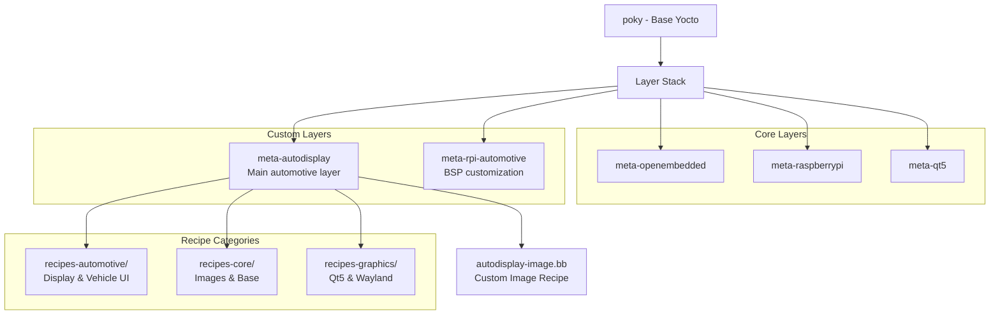
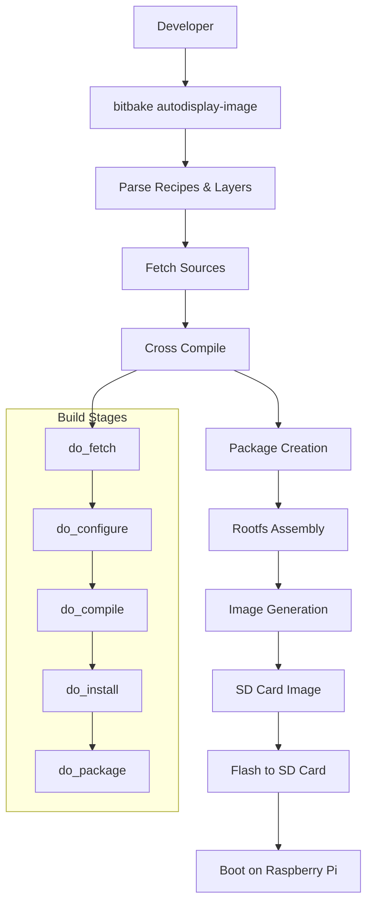
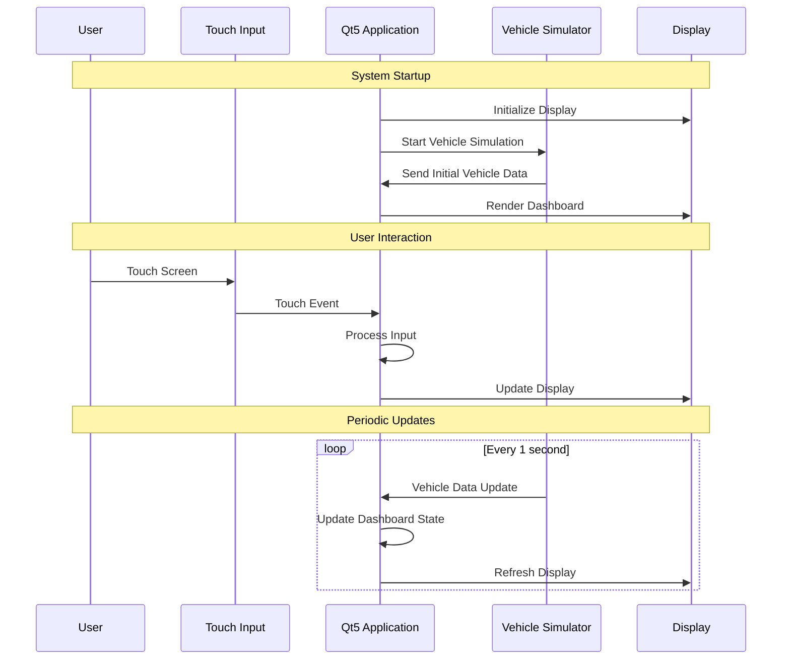
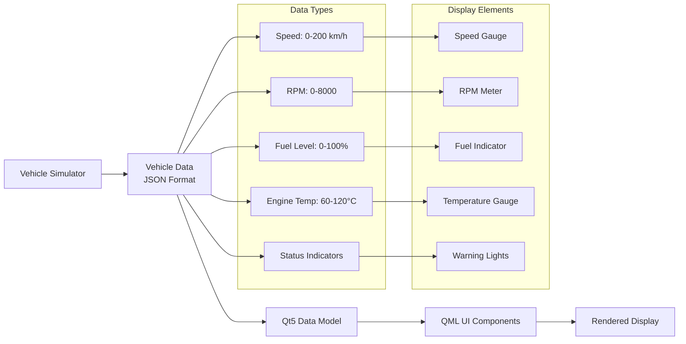
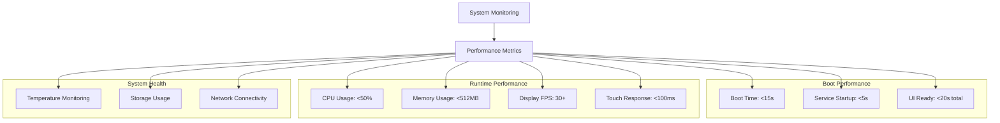

# AutoDisplay-Yocto Architecture 📐

## System Architecture Overview

### High-Level System Architecture
```mermaid
graph TB
    A[Development Host<br/>Ubuntu 22.04] --> B[Yocto Build System<br/>Kirkstone LTS]
    B --> C[Custom Layers]
    C --> D[meta-autodisplay]
    C --> E[meta-rpi-automotive]
    
    D --> F[AutoDisplay Image]
    E --> F
    
    F --> G[Raspberry Pi 4B<br/>Target Hardware]
    G --> H[7" Touch Display]
    G --> I[Vehicle Simulation]
    
    subgraph "Target System"
        J[Linux Kernel 6.1]
        K[Qt5/QML Runtime]
        L[Wayland Compositor]
        M[Vehicle Services]
    end
    
    G --> J
    J --> K
    K --> L
    L --> M
    M --> H
```

### Yocto Layer Architecture


### Build Process Flow


### Runtime System Architecture
```mermaid
graph TB
    A[Boot Loader<br/>U-Boot] --> B[Linux Kernel 6.1<br/>ARM64]
    B --> C[systemd Init System]
    
    subgraph "System Services"
        D[Wayland Compositor]
        E[Qt5 Platform Plugin]
        F[AutoDisplay Service]
        G[Vehicle Simulator]
    end
    
    C --> D
    C --> E
    C --> F
    C --> G
    
    subgraph "Application Layer"
        H[AutoDisplay QML App]
        I[Touch Input Handler]
        J[Vehicle Data Provider]
    end
    
    F --> H
    E --> I
    G --> J
    
    H --> K[7" Touch Display<br/>1024x600]
    I --> K
    
    subgraph "Hardware Interfaces"
        L[DSI Display Interface]
        M[I2C Touch Controller]
        N[GPIO Status LEDs]
    end
    
    K --> L
    I --> M
    J --> N
```

### Software Component Interaction


### Data Flow Architecture


### Development Workflow
```mermaid
gitgraph
    commit id: "Project Setup"
    branch layer-development
    checkout layer-development
    commit id: "Create meta-autodisplay"
    commit id: "Add vehicle UI recipe"
    commit id: "Configure Qt5 integration"
    
    checkout main
    merge layer-development
    commit id: "Initial Build Test"
    
    branch ui-development
    checkout ui-development
    commit id: "QML Dashboard Design"
    commit id: "Touch Input Handler"
    commit id: "Vehicle Data Integration"
    
    checkout main
    merge ui-development
    commit id: "System Integration"
    
    branch optimization
    checkout optimization
    commit id: "Boot Time Optimization"
    commit id: "Memory Usage Tuning"
    commit id: "Display Performance"
    
    checkout main
    merge optimization
    commit id: "Release v1.0"
```

### Deployment Architecture
```mermaid
graph TB
    A[Development Environment] --> B[Build Process]
    B --> C[Generated Images]
    
    subgraph "Image Artifacts"
        D[autodisplay-image-raspberrypi4-64.wic]
        E[SDK for Development]
        F[Debug Symbols]
    end
    
    C --> D
    C --> E
    C --> F
    
    D --> G[SD Card Flashing]
    G --> H[Target Hardware Setup]
    
    subgraph "Target Deployment"
        I[Raspberry Pi 4B]
        J[7" DSI Touch Display]
        K[Power Supply 5V/3A]
        L[32GB SD Card]
    end
    
    H --> I
    H --> J
    H --> K
    H --> L
    
    I --> M[Boot & Initialize]
    M --> N[AutoDisplay Running]
```

### Performance Monitoring


## Architecture Benefits

### Scalability
- **Modular Design**: Easy to add new vehicle features
- **Layer Architecture**: Reusable components for other projects
- **Service-Oriented**: Independent services for different functions

### Maintainability
- **Clear Separation**: UI, business logic, and data layers
- **Standard Frameworks**: Qt5/QML for automotive UI development
- **Documentation**: Comprehensive architecture documentation

### Performance
- **Optimized Boot**: Fast startup for automotive requirements
- **Efficient Rendering**: Hardware-accelerated graphics
- **Resource Management**: Controlled memory and CPU usage

### Industry Alignment
- **Automotive Standards**: Following automotive software practices
- **Yocto Best Practices**: Professional embedded Linux development
- **Modern UI Framework**: Qt5 widely used in automotive industry

---

> **Architecture Foundation**: This beginner project establishes the architectural patterns and development practices used throughout the portfolio, providing a solid foundation for more complex automotive systems. 