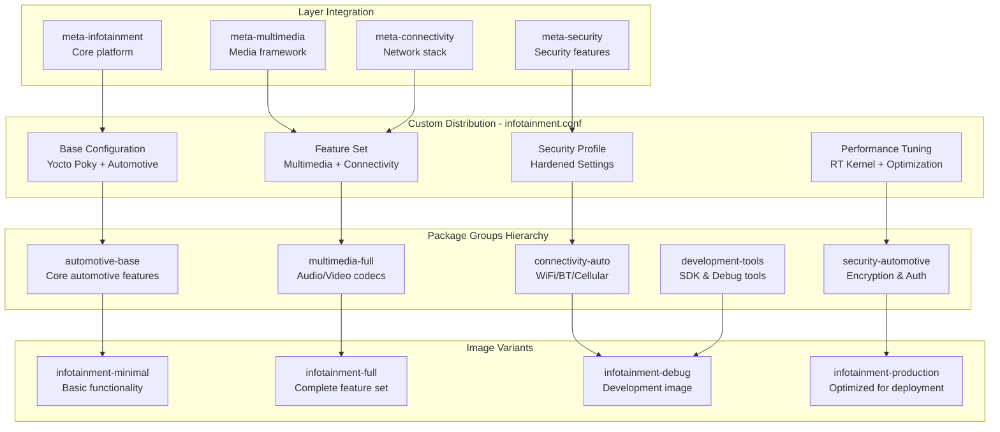
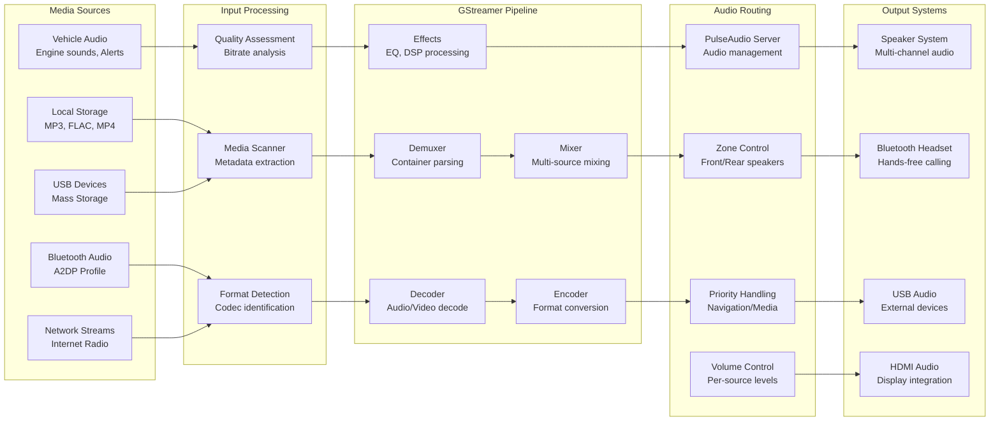
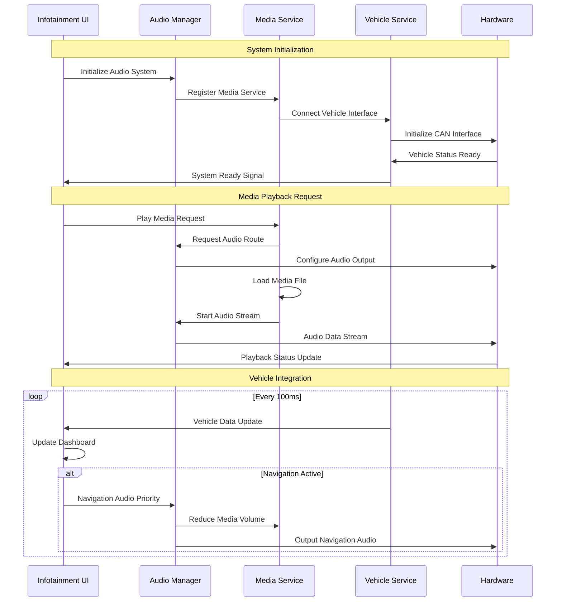

# Project 2: InfuTainment-Platform 🚗🎵
## Intermediate Level: Custom Yocto Image for Vehicle Infotainment

[](https://github.com)
[](https://github.com)
[](https://github.com)
[](https://www.yoctoproject.org/)

> **Advanced custom Yocto image creation with automotive middleware integration for modern vehicle infotainment systems**

## 🎯 Project Overview

### Description
Create a sophisticated custom Yocto image for automotive infotainment systems with advanced multimedia capabilities, middleware integration, and automotive-specific services. This project focuses on mastering custom image recipes, BSP integration, and automotive middleware stack.

### Target Skill Level Justification
- **Intermediate complexity**: Advanced image customization and middleware integration
- **Custom image focus**: Deep dive into image recipes, package management, and distribution creation
- **Industry relevance**: Modern infotainment systems require sophisticated software stacks
- **Scalable architecture**: Foundation for production automotive deployment

### Real-World Application Scenario
Modern vehicle infotainment systems require:
- **Multimedia Processing**: Audio/video playback, streaming services integration
- **Connectivity**: Bluetooth, WiFi, cellular, Android Auto/CarPlay
- **Navigation**: GPS integration, map rendering, traffic updates
- **Vehicle Integration**: CAN bus communication, steering wheel controls, climate control
- **User Experience**: Multi-language support, personalization, voice control

### Learning Objectives
1. **Master Custom Image Creation**: Deep understanding of image recipes and package management
2. **BSP Integration**: Advanced board support package customization and optimization
3. **Middleware Development**: Integration of automotive middleware and communication stacks
4. **Performance Optimization**: Memory management, boot optimization, and runtime performance
5. **Production Readiness**: Security, update mechanisms, and deployment strategies

## 🔧 Technical Specifications

### Hardware Requirements
- **Primary**: Raspberry Pi 4B (8GB RAM) with automotive expansion
- **Audio**: USB audio interface or I2S DAC for high-quality audio
- **Display**: 10" HDMI capacitive touchscreen (1280x800)
- **Connectivity**: USB WiFi adapter, Bluetooth dongle, CAN bus interface
- **Storage**: 64GB+ microSD card + USB storage for media
- **Development Host**: Ubuntu 22.04 LTS (16GB RAM, 200GB free space)

### Software Stack
```yaml
Yocto Project: Kirkstone/Scarthgap (dual support)
Linux Kernel: 6.1 LTS with RT patches
Graphics: Wayland/Weston with GPU acceleration
Audio: PulseAudio with automotive profiles
Middleware: D-Bus, systemd, NetworkManager
UI Framework: Qt6/QML with automotive extensions
Connectivity: BlueZ, wpa_supplicant, ModemManager
```

### Custom Layer Architecture
```
meta-infotainment/              # Core infotainment layer
├── conf/
│   ├── layer.conf
│   └── distro/
│       └── infotainment.conf   # Custom distribution configuration
├── recipes-automotive/
│   ├── middleware/             # Automotive middleware stack
│   ├── audio-manager/          # Audio routing and management
│   ├── connectivity/           # Bluetooth, WiFi, cellular
│   └── vehicle-interface/      # CAN bus and vehicle communication
├── recipes-multimedia/
│   ├── media-player/           # Advanced media playback
│   ├── streaming-services/     # Spotify, YouTube Music integration
│   └── audio-processing/       # DSP and audio enhancement
├── recipes-core/
│   ├── images/                # Custom image recipes
│   ├── packagegroups/         # Package group definitions
│   └── base-files/           # Custom configuration files
└── recipes-graphics/
    ├── wayland/              # Wayland compositor customization
    └── qt6/                  # Qt6 automotive extensions

meta-infotainment-bsp/          # BSP customization layer
├── conf/layer.conf
├── recipes-kernel/
│   └── linux/                # Kernel configuration for infotainment
├── recipes-bsp/
│   ├── bootfiles/            # Boot optimization
│   └── firmware/             # Hardware-specific firmware
└── recipes-connectivity/
    └── bluetooth/            # Bluetooth audio profiles
```

## 🏗️ Layered System Architecture

### Infotainment Platform Layers
```mermaid
graph TB
    subgraph "Application Layer"
        A1[Infotainment UI<br/>Qt6/QML Interface]
        A2[Media Player<br/>Audio/Video Control]
        A3[Navigation App<br/>GPS & Mapping]
        A4[Vehicle Interface<br/>CAN Data Display]
    end
    
    subgraph "Service Layer"
        S1[Audio Manager<br/>Sound Routing]
        S2[Media Service<br/>Playback Control]
        S3[Navigation Service<br/>Route Planning]
        S4[Vehicle Data Service<br/>CAN Gateway]
        S5[Connectivity Manager<br/>Network Control]
    end
    
    subgraph "Middleware Layer"
        M1[D-Bus System Bus<br/>IPC Communication]
        M2[GStreamer Pipeline<br/>Multimedia Framework]
        M3[PulseAudio<br/>Audio Subsystem]
        M4[ConnMan<br/>Connection Manager]
        M5[BlueZ<br/>Bluetooth Stack]
    end
    
    subgraph "OS Services Layer"
        O1[systemd<br/>Service Management]
        O2[Wayland<br/>Display Server]
        O3[NetworkManager<br/>Network Services]
        O4[udev<br/>Device Management]
    end
    
    subgraph "Kernel Layer"
        K1[Linux Kernel 6.1<br/>RT Extensions]
        K2[CAN Bus Subsystem<br/>SocketCAN]
        K3[Audio Subsystem<br/>ALSA/ASoC]
        K4[Display Drivers<br/>DRM/KMS]
        K5[Network Stack<br/>TCP/IP, Bluetooth]
    end
    
    subgraph "Hardware Layer"
        H1[Raspberry Pi 4B<br/>8GB RAM]
        H2[10" Touch Display<br/>HDMI Interface]
        H3[USB Audio Interface<br/>High-Quality DAC]
        H4[CAN Hat<br/>MCP2515 Controller]
        H5[WiFi/Bluetooth<br/>Dual-band Module]
    end
    
    A1 --> S1
    A2 --> S2
    A3 --> S3
    A4 --> S4
    S1 --> M1
    S2 --> M2
    S3 --> M3
    S4 --> M4
    S5 --> M5
    M1 --> O1
    M2 --> O2
    M3 --> O3
    M4 --> O4
    M5 --> O1
    O1 --> K1
    O2 --> K2
    O3 --> K3
    O4 --> K4
    K1 --> H1
    K2 --> H2
    K3 --> H3
    K4 --> H4
    K5 --> H5
```

### Custom Distribution Architecture


### Multimedia Processing Pipeline


### Service Communication Architecture


## 🚀 Implementation Roadmap

### Phase 1: Advanced Environment & Distribution Setup (Week 1)
**Objective**: Establish custom distribution with advanced build configuration

**Key Tasks**:
- Create custom Yocto distribution configuration
- Set up advanced build optimization and caching
- Implement multi-machine support and cross-compilation
- Establish CI/CD pipeline with automated testing

**Deliverables**:
- Custom `infotainment.conf` distribution
- Optimized build environment with shared state
- Multi-target build configuration
- Automated build and test pipeline

### Phase 2: Custom Image Recipe Development (Week 2)
**Objective**: Master advanced image customization and package management

**Key Tasks**:
- Develop modular image recipe architecture
- Create custom package groups for automotive features
- Implement image inheritance and customization
- Set up SDK generation and development tools

**Deliverables**:
- Advanced image recipe with multiple variants
- Custom package groups for different vehicle types
- Generated SDK for application development
- Image customization framework

### Phase 3: Automotive Middleware Integration (Weeks 3-4)
**Objective**: Integrate comprehensive automotive middleware stack

**Key Tasks**:
- Implement D-Bus automotive service architecture
- Integrate audio management and routing system
- Develop vehicle communication interface (CAN bus)
- Create connectivity management framework

**Deliverables**:
- Automotive middleware service architecture
- Audio routing and management system
- Vehicle communication interface
- Connectivity management framework

### Phase 4: Advanced UI and Multimedia (Week 5)
**Objective**: Develop sophisticated infotainment user interface

**Key Tasks**:
- Create advanced Qt6/QML automotive interface
- Integrate multimedia playback and streaming
- Implement navigation and mapping system
- Develop voice control and recognition system

**Deliverables**:
- Advanced automotive UI with navigation
- Multimedia system with streaming integration
- Voice control system
- Performance-optimized graphics pipeline

### Phase 5: Production Optimization & Deployment (Week 6)
**Objective**: Optimize for production deployment and create comprehensive documentation

**Key Tasks**:
- Implement security hardening and update mechanisms
- Optimize performance and memory usage
- Create deployment and installation procedures
- Develop comprehensive documentation and testing

**Deliverables**:
- Production-ready image with security features
- Performance optimization documentation
- Deployment automation scripts
- Professional portfolio presentation

## 📋 Key Implementation Examples

### Custom Distribution Configuration
```bash
# conf/distro/infotainment.conf
DISTRO = "infotainment"
DISTRO_NAME = "Automotive Infotainment Linux"
DISTRO_VERSION = "1.0"
DISTRO_CODENAME = "AuroraOne"

# Automotive-specific features
DISTRO_FEATURES = "systemd wayland pam bluetooth wifi \
                   automotive multimedia security"

# Performance optimizations
PREFERRED_PROVIDER_virtual/kernel = "linux-yocto-rt"
PREFERRED_VERSION_linux-yocto-rt = "6.1%"

# Security settings
EXTRA_IMAGE_FEATURES += "read-only-rootfs"
IMAGE_FEATURES += "ssh-server-openssh package-management"

# Automotive middleware
PREFERRED_PROVIDER_automotive-middleware = "automotive-middleware-stack"
```

### Advanced Image Recipe
```bash
# recipes-core/images/infotainment-image.bb
SUMMARY = "Advanced Automotive Infotainment System"
DESCRIPTION = "Full-featured infotainment system with middleware integration"

LICENSE = "MIT"

inherit core-image automotive-image

# Package groups for modular installation
IMAGE_INSTALL = "\
    packagegroup-core-boot \
    packagegroup-automotive-base \
    packagegroup-multimedia-full \
    packagegroup-connectivity-automotive \
    packagegroup-security-automotive \
    ${CORE_IMAGE_EXTRA_INSTALL} \
"

# Automotive-specific features
IMAGE_FEATURES += "\
    automotive-middleware \
    multimedia-full \
    connectivity-automotive \
    security-hardened \
    development-tools \
"

# Performance and storage optimization
IMAGE_ROOTFS_EXTRA_SPACE = "4096"
IMAGE_ROOTFS_ALIGNMENT = "4096"
IMAGE_FSTYPES += "ext4 tar.xz"

# OTA update support
INHERIT += "automotive-ota"
```

### Automotive Middleware Service
```bash
# recipes-automotive/middleware/automotive-middleware.bb
SUMMARY = "Automotive Middleware Service Stack"
DESCRIPTION = "D-Bus based automotive service architecture"

LICENSE = "MIT"
LIC_FILES_CHKSUM = "file://LICENSE;md5=..."

DEPENDS = "dbus glib-2.0 json-glib libsystemd"
RDEPENDS_${PN} = "dbus systemd"

SRC_URI = "git://github.com/automotive/middleware.git;branch=main"
SRCREV = "latest"

S = "${WORKDIR}/git"

inherit meson pkgconfig systemd

SYSTEMD_SERVICE_${PN} = "automotive-middleware.service"
SYSTEMD_AUTO_ENABLE = "enable"

do_install_append() {
    # Install D-Bus service configuration
    install -d ${D}${datadir}/dbus-1/system-services
    install -m 0644 ${S}/dbus/*.service ${D}${datadir}/dbus-1/system-services/
    
    # Install automotive configuration
    install -d ${D}${sysconfdir}/automotive
    install -m 0644 ${S}/config/*.conf ${D}${sysconfdir}/automotive/
}

FILES_${PN} += "${datadir}/dbus-1/system-services/* \
                ${sysconfdir}/automotive/*"
```

## 📚 Documentation Strategy

### Professional GitHub Repository
```
infotainment-platform/
├── README.md                    # Professional overview
├── ARCHITECTURE.md              # System architecture
├── BUILD.md                     # Build instructions
├── DEPLOYMENT.md                # Deployment guide
├── CUSTOMIZATION.md             # Customization guide
├── meta-infotainment/          # Core custom layer
├── meta-infotainment-bsp/      # BSP layer
├── documentation/              # Technical documentation
│   ├── middleware-api/         # API documentation
│   ├── performance-analysis/   # Performance benchmarks
│   └── security-guide/         # Security implementation
├── testing/                    # Automated testing
│   ├── unit-tests/
│   ├── integration-tests/
│   └── performance-tests/
└── deployment/                 # Deployment automation
    ├── scripts/
    ├── docker/
    └── ci-cd/
```

### Mermaid System Architecture


### YouTube Video Outline (15 minutes)
1. **Introduction** (2 min): Custom image creation importance in automotive
2. **Architecture Overview** (3 min): Distribution and layer structure
3. **Live Build Process** (4 min): Custom image creation demonstration
4. **Feature Demonstration** (4 min): Infotainment system in action
5. **Code Deep-dive** (2 min): Key recipes and configurations

### LinkedIn Content Strategy
- **Week 1**: "Building custom Yocto distributions for automotive applications"
- **Week 2**: "Advanced image recipe development - lessons learned"
- **Week 3**: "Integrating automotive middleware with Yocto Project"
- **Week 4**: "Performance optimization in automotive embedded systems"
- **Week 5**: "Modern infotainment UI development with Qt6"
- **Week 6**: "Production deployment of automotive Linux systems"

## 🎖️ Professional Development Impact

### Resume Enhancement
```
AUTOMOTIVE INFOTAINMENT PLATFORM (Custom Yocto Distribution)        2024
• Developed custom Yocto distribution for automotive infotainment with advanced middleware integration
• Created modular image recipes supporting multiple vehicle configurations and deployment scenarios
• Implemented automotive middleware stack with D-Bus services for vehicle communication and audio management
• Integrated multimedia playbook with streaming services, navigation, and voice control capabilities
• Optimized system performance achieving <20 second boot time and <2GB memory footprint
• Established production deployment pipeline with OTA updates and security hardening
• Technologies: Yocto Project, Qt6/QML, D-Bus, PulseAudio, Bluetooth, automotive protocols
```

### Skills Demonstrated
- **Advanced Yocto Mastery**: Custom distribution creation, advanced image recipes, BSP integration
- **Automotive Domain Expertise**: Middleware integration, vehicle communication, automotive UI/UX
- **System Architecture**: Service-oriented architecture, performance optimization, security implementation
- **Production Engineering**: Deployment automation, OTA updates, quality assurance
- **Industry Standards**: Automotive software development practices, security compliance

---

> **Next Steps**: Proceed to [Project 3: CAN-RT-Gateway](../03_advanced_can_gateway/) to build advanced real-time capabilities and automotive protocol expertise.

### 🏷️ Project Tags
`#CustomYoctoImage` `#AutomotiveMiddleware` `#InfotainmentSystems` `#YoctoDistribution` `#EmbeddedLinux` `#AutomotiveEngineering` `#Qt6` `#MultimediaIntegration` `#VehicleSystems` `#ProductionDeployment` 