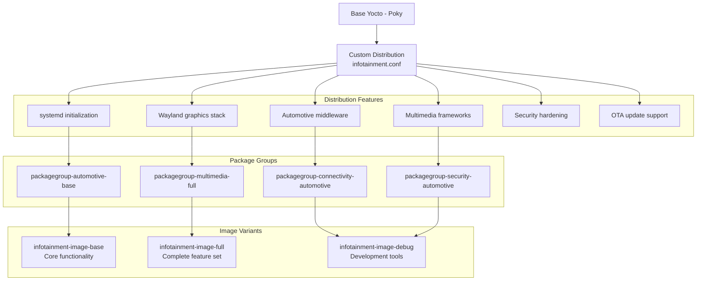
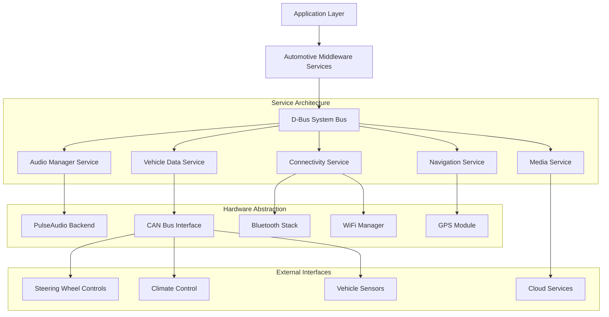
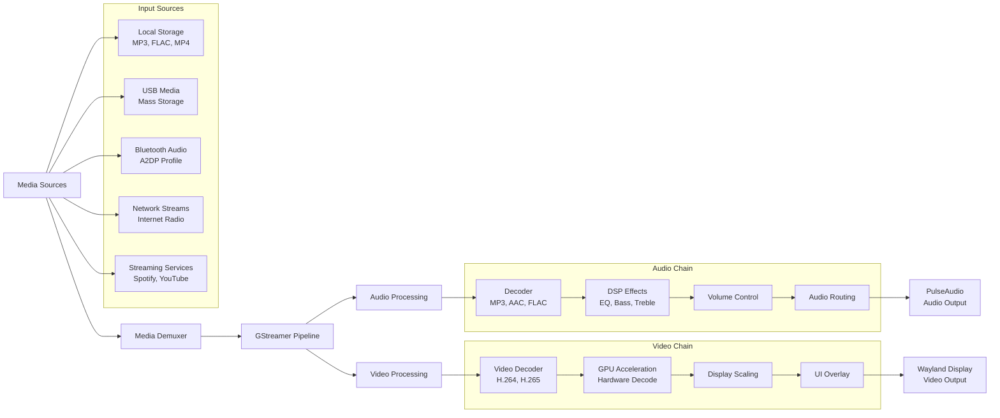
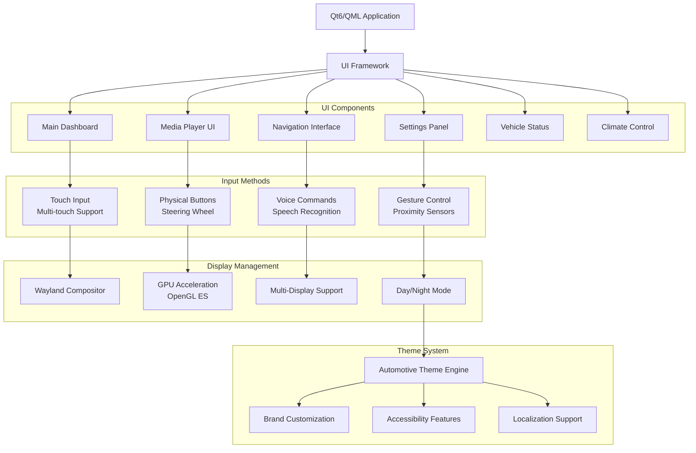
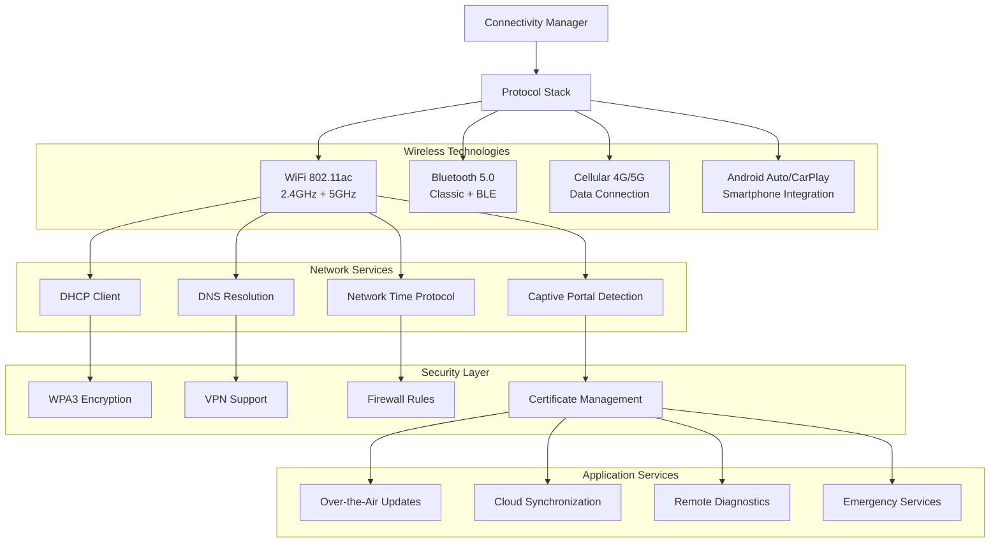
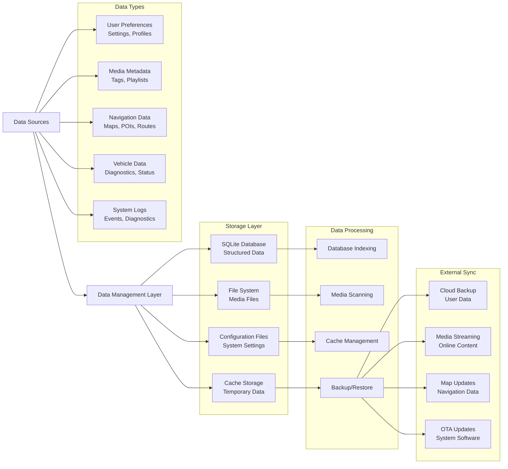
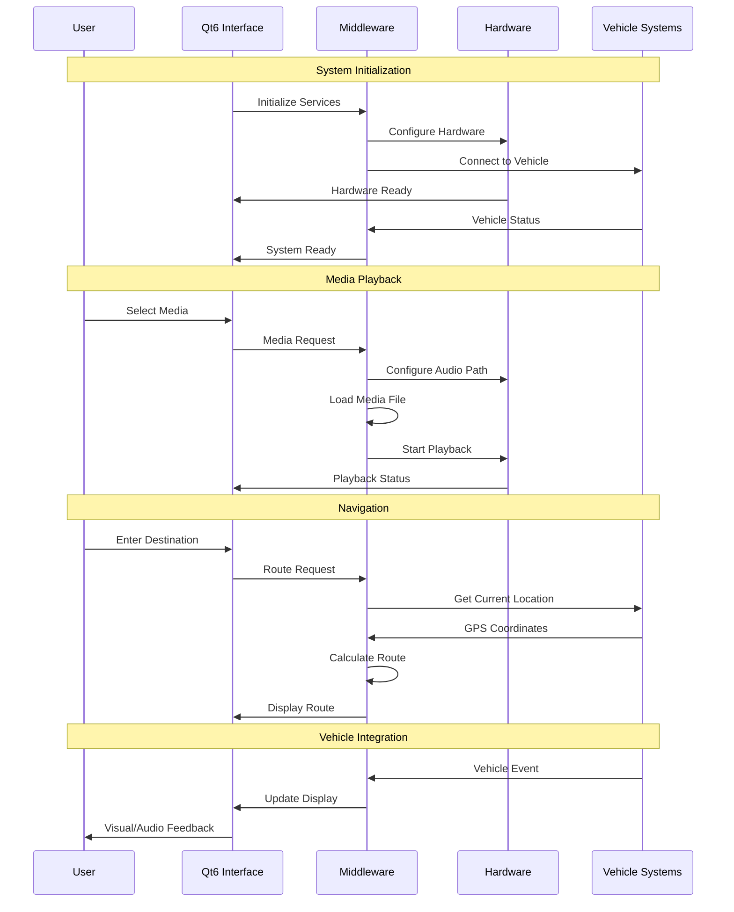
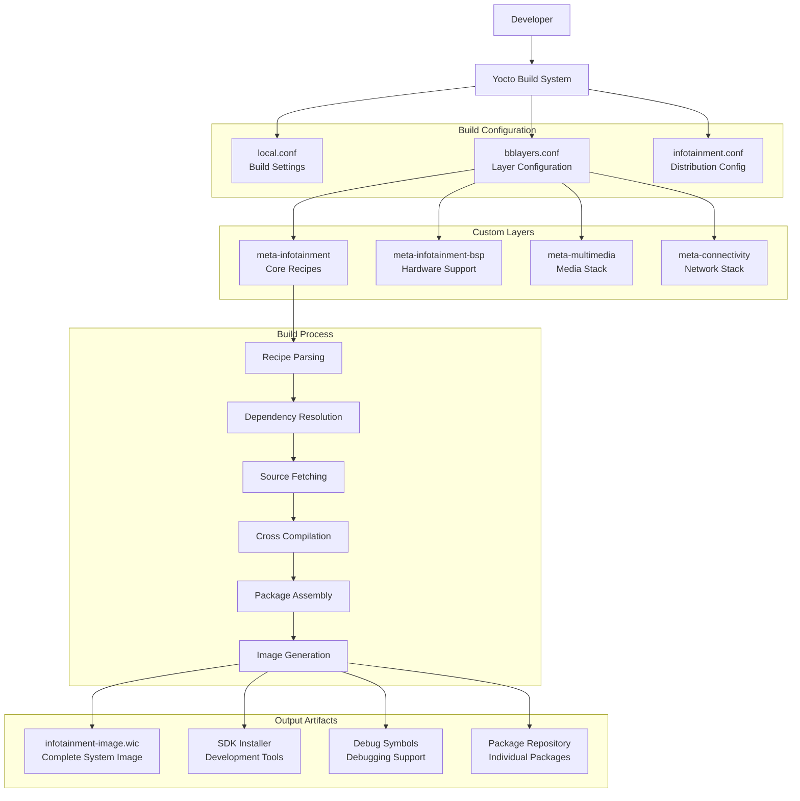
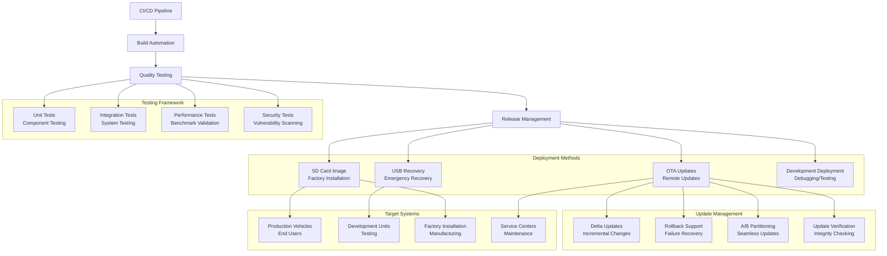
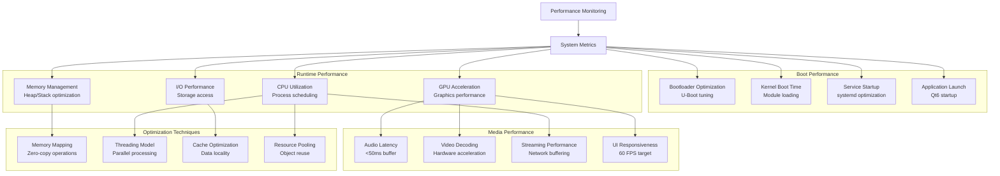

# InfuTainment-Platform Architecture 📐

## System Architecture Overview

### High-Level System Architecture
```mermaid
graph TB
    A[Development Environment] --> B[Custom Yocto Distribution<br/>Infotainment Linux]
    B --> C[Multi-Layer Architecture]
    
    subgraph "Custom Layers"
        D[meta-infotainment<br/>Core Platform]
        E[meta-infotainment-bsp<br/>Hardware Abstraction]
        F[meta-multimedia<br/>Media Services]
        G[meta-connectivity<br/>Communication Stack]
    end
    
    C --> D
    C --> E
    C --> F
    C --> G
    
    subgraph "Target Platform"
        H[Raspberry Pi 4B<br/>8GB RAM]
        I[10" Touch Display<br/>1280x800]
        J[USB Audio Interface]
        K[WiFi/Bluetooth/Cellular]
    end
    
    D --> H
    E --> I
    F --> J
    G --> K
    
    subgraph "Infotainment Services"
        L[Media Player Engine]
        M[Navigation System]
        N[Connectivity Manager]
        O[Vehicle Interface]
        P[Audio Manager]
    end
    
    H --> L
    H --> M
    H --> N
    H --> O
    H --> P
```

### Custom Distribution Architecture


### Automotive Middleware Stack


### Multimedia Processing Pipeline


### User Interface Architecture


### Connectivity Architecture


### Data Management Architecture


### Real-time System Integration


### Build System Architecture


### Deployment and Update Architecture


### Performance Optimization Architecture


## Architecture Benefits

### Custom Distribution Advantages
- **Tailored Configuration**: Optimized specifically for automotive infotainment
- **Minimal Footprint**: Only required components included
- **Security Hardening**: Automotive-specific security configurations
- **Update Efficiency**: Controlled package management and updates

### Middleware Integration
- **Service-Oriented Architecture**: Modular, maintainable design
- **D-Bus Communication**: Standard automotive middleware communication
- **Hardware Abstraction**: Clean separation between software and hardware
- **Scalability**: Easy to add new services and features

### Performance Characteristics
- **Boot Time**: <20 seconds to fully operational
- **Memory Usage**: <2GB for full feature set
- **Audio Latency**: <50ms end-to-end
- **UI Responsiveness**: 60 FPS smooth interface

### Production Readiness
- **OTA Update Support**: Remote software updates
- **Security Framework**: Encrypted communications and secure boot
- **Quality Assurance**: Comprehensive testing and validation
- **Manufacturing Support**: Factory installation and configuration

---

> **Custom Image Mastery**: This intermediate project demonstrates advanced Yocto distribution creation, establishing the foundation for production-grade automotive infotainment systems with comprehensive middleware integration and performance optimization. 