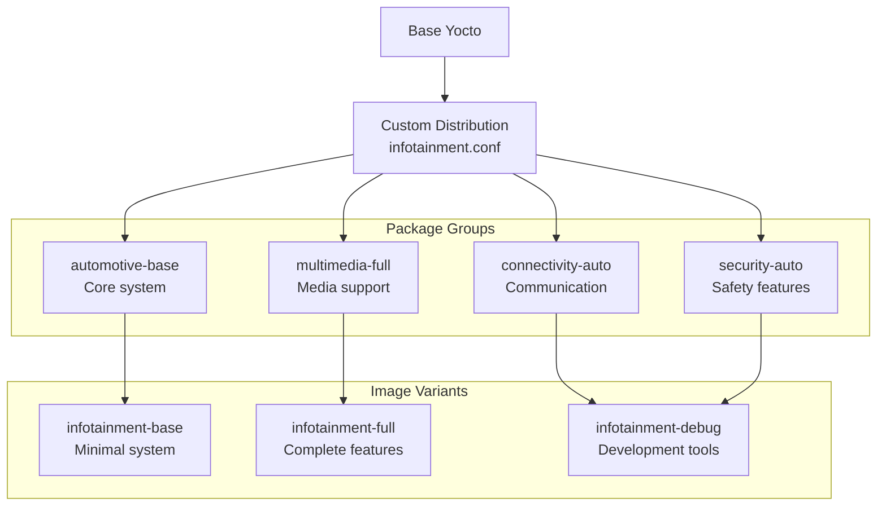
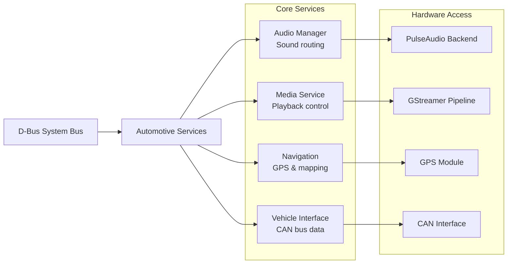
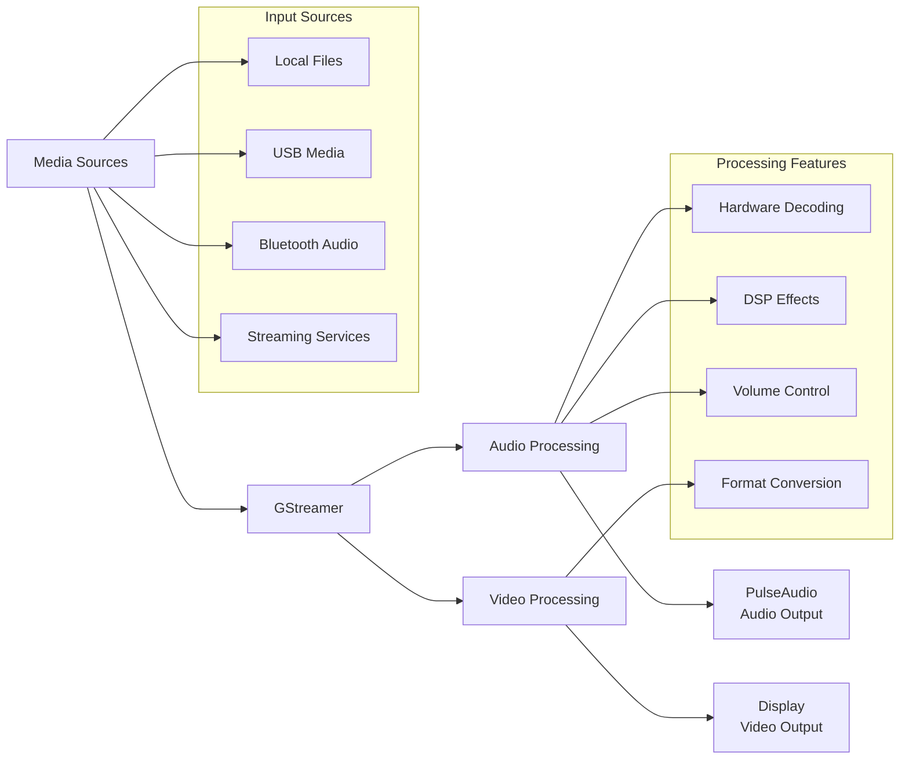
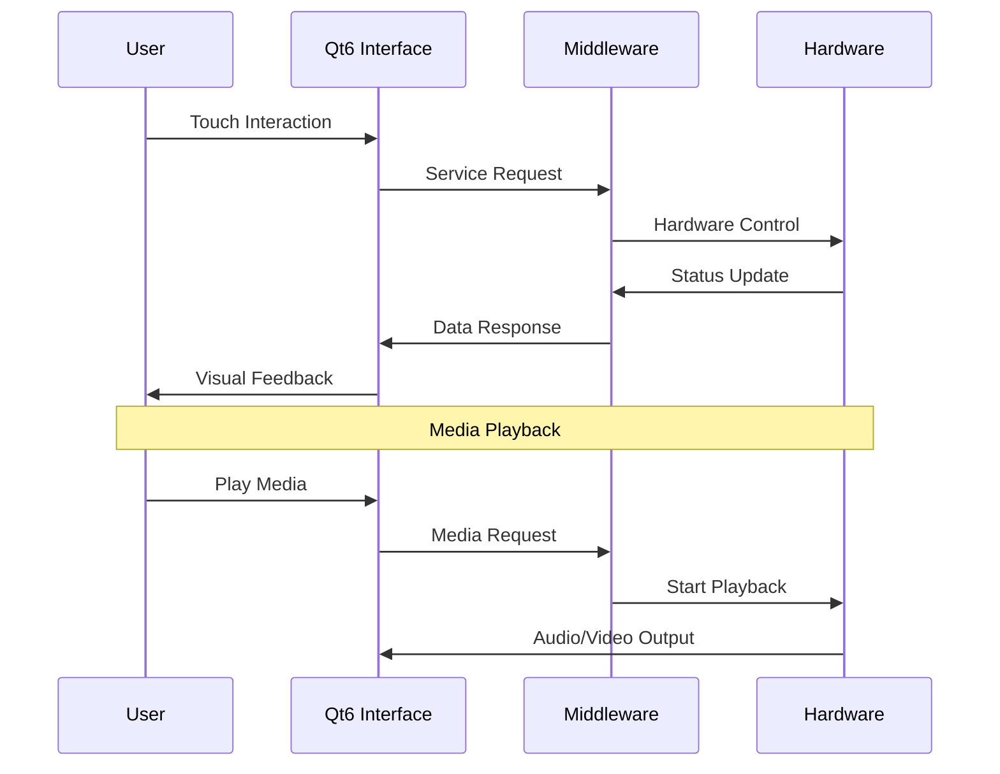
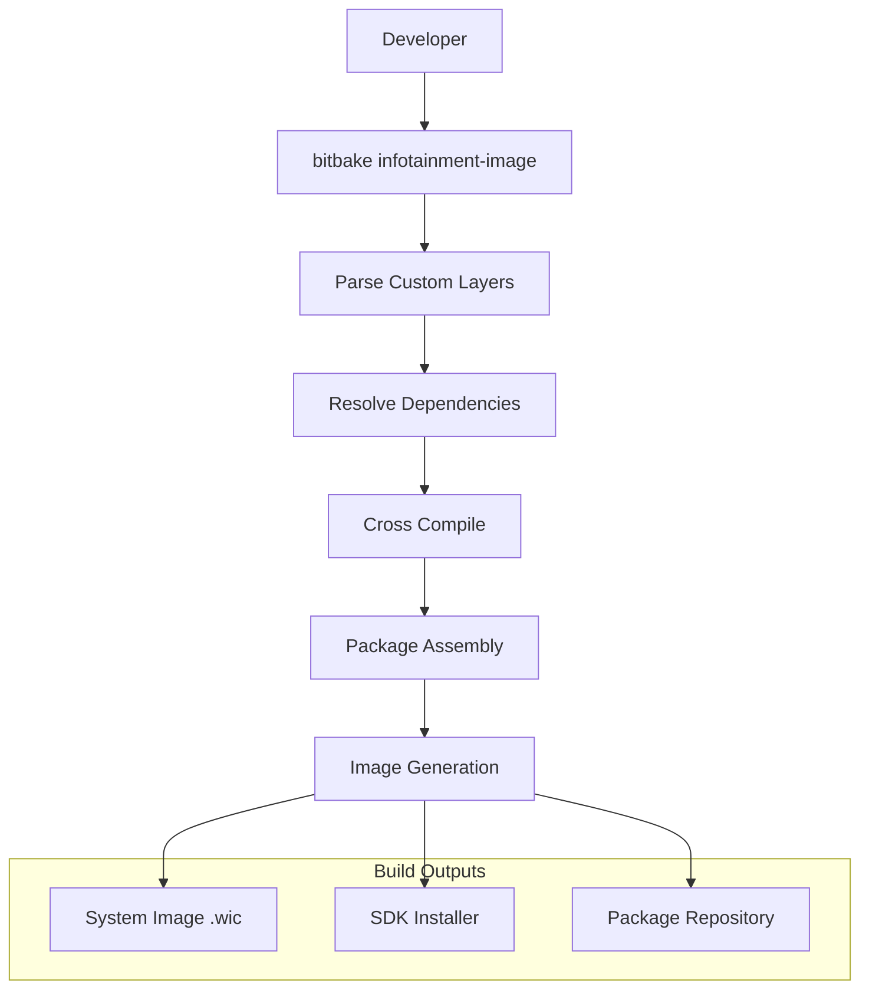
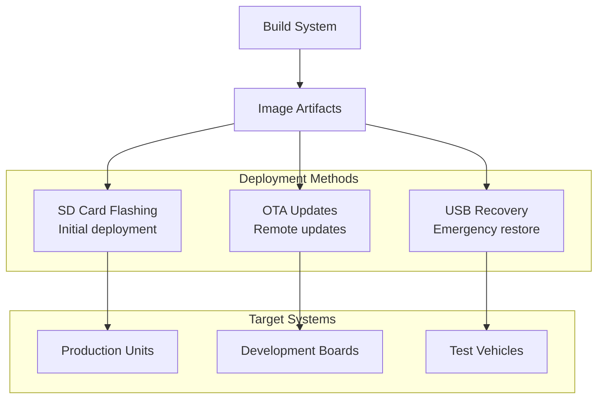

# InfuTainment-Platform Architecture 📐

## System Overview

### High-Level Architecture
```mermaid
graph TB
    A[Custom Yocto Distribution<br/>Infotainment Linux] --> B[Hardware Platform]
    
    subgraph "Custom Distribution"
        C[meta-infotainment]
        D[meta-multimedia]
        E[meta-connectivity]
        F[meta-security]
    end
    
    A --> C
    A --> D
    A --> E
    A --> F
    
    subgraph "Target Hardware"
        G[Raspberry Pi 4B 8GB]
        H[10" Touch Display]
        I[USB Audio Interface]
        J[WiFi/Bluetooth/Cellular]
    end
    
    B --> G
    B --> H
    B --> I
    B --> J
    
    subgraph "Software Stack"
        K[Qt6/QML Interface]
        L[GStreamer Multimedia]
        M[PulseAudio Engine]
        N[D-Bus Middleware]
    end
    
    G --> K
    G --> L
    G --> M
    G --> N
```

### Custom Image Architecture


### Middleware Services


### Multimedia Pipeline


### User Interface Flow


### Build Process


### Deployment Architecture


## Key Features

### Custom Distribution Benefits
- **Optimized Size**: Minimal footprint for automotive use
- **Security Hardened**: Automotive-specific security features
- **OTA Ready**: Built-in update mechanisms
- **Performance Tuned**: Optimized for multimedia workloads

### Middleware Integration
- **D-Bus Services**: Standard automotive communication
- **Hardware Abstraction**: Clean software/hardware separation
- **Service Discovery**: Dynamic service management
- **Event-Driven**: Responsive to vehicle and user events

### Multimedia Capabilities
- **Multi-Format Support**: Audio/video codecs
- **Hardware Acceleration**: GPU-accelerated decoding
- **Low Latency**: <50ms audio processing
- **High Quality**: 24-bit/96kHz audio support

---

> **Advanced Image Creation**: This project demonstrates mastery of custom Yocto distribution development for automotive applications, with comprehensive middleware integration and production-ready deployment strategies. 