# Project 3: CAN-RT-Gateway 🚗⚡
## Advanced Level: Automotive ECU Simulation with Real-time CAN Bus

[](https://github.com)
[](https://github.com)
[](https://github.com)
[](https://www.can-cia.org/)

> **Real-time automotive ECU gateway with CAN bus communication, RT kernel optimization, and safety-critical system design**

## 🎯 Project Overview

### Description
Develop a sophisticated automotive ECU (Electronic Control Unit) simulation system with real-time CAN bus communication capabilities. This project demonstrates advanced real-time system design, automotive protocol implementation, and safety-critical embedded system development using RT-enabled Linux kernel.

### Target Skill Level Justification
- **Advanced real-time systems**: RT kernel patches, latency analysis, timing guarantees
- **Automotive protocols**: Deep CAN bus integration, ECU simulation, automotive standards
- **Safety-critical design**: Deterministic behavior, fault tolerance, automotive safety standards
- **Production-grade implementation**: Professional development practices for automotive industry

### Real-World Application Scenario
Modern vehicles contain 50-100+ ECUs communicating via CAN bus networks:
- **Engine Management**: Real-time control of fuel injection, ignition timing
- **Safety Systems**: ABS, ESC, airbag controllers with <10ms response requirements
- **Gateway Functions**: Protocol translation between different vehicle networks
- **Diagnostics**: OBD-II compliance, fault detection and reporting
- **Autonomous Systems**: Sensor fusion, decision making with strict timing constraints

### Learning Objectives
1. **Real-time Linux Mastery**: RT kernel configuration, latency optimization, timing analysis
2. **CAN Bus Expertise**: Protocol implementation, message filtering, network management
3. **ECU Simulation**: Automotive system modeling, behavior simulation, testing frameworks
4. **Safety-Critical Development**: Deterministic design, fault tolerance, automotive standards compliance
5. **Performance Engineering**: System optimization, resource management, timing verification

## 🔧 Technical Specifications

### Hardware Requirements
- **Primary Target**: BeagleBone Black (ARM Cortex-A8, real-time capabilities)
- **CAN Interface**: MCP2515 CAN controller with SPI interface
- **Alternative**: Raspberry Pi 4B + CAN HAT for development
- **CAN Network**: Multiple CAN transceivers for multi-network simulation
- **Development Tools**: Oscilloscope for timing analysis, CAN analyzer
- **Host System**: Ubuntu 22.04 LTS with kernel development tools

### Software Stack
```yaml
Linux Kernel: 6.1 RT (PREEMPT_RT patches)
Yocto Project: Scarthgap with RT optimizations
CAN Stack: SocketCAN, can-utils, J1939 protocol
Real-time: RT_PREEMPT, high-resolution timers
ECU Simulation: Custom automotive ECU models
Diagnostics: OBD-II implementation, UDS protocol
Testing: RT testing suite, latency measurement tools
Safety: Watchdog, fault injection, recovery mechanisms
```

### System Architecture
```
RT-Linux Kernel (PREEMPT_RT)
├── SocketCAN Framework
│   ├── CAN0: Engine Management Network
│   ├── CAN1: Body Electronics Network  
│   └── CAN2: Diagnostics Network
├── ECU Simulation Framework
│   ├── Engine ECU Simulator
│   ├── ABS ECU Simulator
│   ├── Gateway ECU Logic
│   └── Diagnostic Services
├── Real-time Services
│   ├── Cyclic Message Handler (1ms precision)
│   ├── Event-driven Response System
│   ├── Timing Analysis & Monitoring
│   └── Safety Watchdog Services
└── Automotive Protocols
    ├── CAN 2.0A/B Support
    ├── J1939 Protocol Stack
    ├── OBD-II/UDS Implementation
    └── Network Management
```

## 🏗️ Layered System Architecture

### Real-time CAN Gateway Layers


### Real-time Processing Architecture


### CAN Network Topology

```mermaid
graph TB
    subgraph "CAN Gateway Node"
        GW1[Gateway Router<br/>Multi-network Bridge]
        GW2[Protocol Translator<br/>J1939 ↔ ISO-TP]
        GW3[Message Filter<br/>Traffic Control]
        GW4[Diagnostic Gateway<br/>OBD-II Interface]
    end
    
    subgraph "Engine Network - CAN0"
        EN1[Engine ECU<br/>ID: 0x7E0]
        EN2[Transmission ECU<br/>ID: 0x7E1]
        EN3[Fuel System ECU<br/>ID: 0x7E2]
        EN4[Exhaust System<br/>ID: 0x7E3]
    end
    
    subgraph "Body Network - CAN1"
        BN1[Body Control Module<br/>ID: 0x760]
        BN2[Door Control Units<br/>ID: 0x761-764]
        BN3[Lighting Control<br/>ID: 0x765]
        BN4[Climate Control<br/>ID: 0x766]
    end
    
    subgraph "Safety Network - CAN2"
        SN1[ABS/ESC ECU<br/>ID: 0x740]
        SN2[Airbag Control<br/>ID: 0x741]
        SN3[Steering Control<br/>ID: 0x742]
        SN4[Brake System<br/>ID: 0x743]
    end
    
    subgraph "Diagnostic Interface"
        DI1[OBD-II Port<br/>Standard Diagnostics]
        DI2[Service Tool<br/>Manufacturer Specific]
        DI3[Telematics Unit<br/>Remote Diagnostics]
    end
    
    GW1 --> EN1
    GW1 --> EN2
    GW1 --> EN3
    GW1 --> EN4
    GW2 --> BN1
    GW2 --> BN2
    GW2 --> BN3
    GW2 --> BN4
    GW3 --> SN1
    GW3 --> SN2
    GW3 --> SN3
    GW3 --> SN4
    GW4 --> DI1
    GW4 --> DI2
    GW4 --> DI3
```


### Safety and Fault Management


### Performance Monitoring Architecture


## 🚀 Implementation Roadmap

### Phase 1: RT Kernel Setup & CAN Hardware Integration (Week 1-2)
**Objective**: Establish RT-enabled Linux system with CAN bus hardware support

**Key Tasks**:
- Configure and build RT Linux kernel (PREEMPT_RT)
- Integrate MCP2515 CAN controller drivers
- Set up SocketCAN framework and tools
- Implement basic CAN message transmission/reception
- Establish RT timing measurement infrastructure

**Deliverables**:
- RT kernel with <100μs latency guarantees
- Functional CAN bus communication
- Basic timing analysis framework
- Hardware abstraction layer for CAN interfaces

**Critical Success Metrics**:
- Maximum interrupt latency: <50μs
- CAN message latency: <1ms
- System jitter: <10μs

### Phase 2: ECU Simulation Framework Development (Week 3-4)
**Objective**: Create comprehensive automotive ECU simulation environment

**Key Tasks**:
- Design modular ECU simulation architecture
- Implement Engine Management ECU with realistic behavior
- Develop ABS/ESC ECU simulation with safety protocols
- Create Body Control Module (BCM) simulation
- Establish inter-ECU communication protocols

**Deliverables**:
- Modular ECU simulation framework
- 3+ realistic ECU simulators
- Inter-ECU message validation
- Configuration-driven ECU behavior

**Performance Targets**:
- Cyclic message generation: 1ms precision
- ECU response time: <5ms
- Message throughput: 1000+ messages/second

### Phase 3: Real-time Gateway & Protocol Implementation (Week 5)
**Objective**: Implement automotive gateway functionality with protocol support

**Key Tasks**:
- Develop CAN gateway routing logic
- Implement J1939 protocol stack
- Create OBD-II diagnostic services
- Build UDS (Unified Diagnostic Services) support
- Establish network management functions

**Deliverables**:
- Multi-network CAN gateway
- J1939 protocol implementation
- OBD-II compliant diagnostic interface
- Network management services

### Phase 4: Safety & Fault Tolerance Implementation (Week 6)
**Objective**: Add safety-critical features and fault tolerance mechanisms

**Key Tasks**:
- Implement automotive safety watchdog systems
- Create fault injection and recovery mechanisms
- Develop diagnostic trouble code (DTC) management
- Build safety-critical message prioritization
- Establish system health monitoring

**Deliverables**:
- Safety watchdog implementation
- Fault tolerance mechanisms
- DTC management system
- Safety-critical message handling

### Phase 5: Performance Optimization & Testing (Week 7)
**Objective**: Optimize system performance and conduct comprehensive testing

**Key Tasks**:
- Perform latency analysis and optimization
- Implement load testing and stress testing
- Create automated test suites for ECU behavior
- Develop performance monitoring dashboard
- Optimize memory usage and CPU utilization

**Deliverables**:
- Performance-optimized system
- Comprehensive test suite
- Performance monitoring tools
- Load testing framework

### Phase 6: Documentation & Professional Presentation (Week 8)
**Objective**: Create professional documentation and portfolio presentation

**Key Tasks**:
- Write comprehensive technical documentation
- Create system architecture diagrams
- Produce demonstration videos
- Prepare professional portfolio materials
- Develop deployment and setup guides

## 📋 Key Implementation Examples

### RT Kernel Configuration
```bash
# RT Kernel build configuration
cd linux-rt-source
make menuconfig

# Critical RT kernel options:
CONFIG_PREEMPT_RT=y
CONFIG_PREEMPT_RT_FULL=y  
CONFIG_HIGH_RES_TIMERS=y
CONFIG_NO_HZ_FULL=y
CONFIG_CAN=y
CONFIG_CAN_RAW=y
CONFIG_CAN_MCP251X=y

# Build and install RT kernel
make -j$(nproc) ARCH=arm CROSS_COMPILE=arm-linux-gnueabihf-
make modules_install INSTALL_MOD_PATH=/path/to/rootfs
```

### CAN ECU Simulator Implementation
```c
// ecu_simulator.c - Engine Management ECU
#include <linux/can.h>
#include <linux/can/raw.h>
#include <sys/socket.h>
#include <time.h>

typedef struct {
    uint16_t rpm;
    uint8_t throttle_position;
    uint8_t engine_temp;
    uint16_t speed;
    uint8_t fuel_level;
} engine_data_t;

class EngineECU {
private:
    int can_socket;
    engine_data_t engine_data;
    struct timespec cycle_time;
    
public:
    EngineECU(const char* interface) {
        // Initialize CAN socket
        can_socket = socket(PF_CAN, SOCK_RAW, CAN_RAW);
        struct sockaddr_can addr;
        strcpy(ifr.ifr_name, interface);
        ioctl(can_socket, SIOCGIFINDEX, &ifr);
        addr.can_family = AF_CAN;
        addr.can_ifindex = ifr.ifr_ifindex;
        bind(can_socket, (struct sockaddr *)&addr, sizeof(addr));
        
        // Set RT priority
        struct sched_param param;
        param.sched_priority = 90;
        sched_setscheduler(0, SCHED_FIFO, &param);
    }
    
    void cyclicTask() {
        struct timespec next_cycle;
        clock_gettime(CLOCK_MONOTONIC, &next_cycle);
        
        while(running) {
            // Update engine simulation
            updateEngineSimulation();
            
            // Send cyclic CAN messages
            sendEngineRPM();
            sendThrottlePosition();
            sendEngineTemperature();
            
            // Handle incoming CAN messages
            processIncomingMessages();
            
            // Precise timing control
            next_cycle.tv_nsec += 10000000; // 10ms cycle
            if (next_cycle.tv_nsec >= 1000000000) {
                next_cycle.tv_sec++;
                next_cycle.tv_nsec -= 1000000000;
            }
            clock_nanosleep(CLOCK_MONOTONIC, TIMER_ABSTIME, &next_cycle, NULL);
        }
    }
    
    void sendEngineRPM() {
        struct can_frame frame;
        frame.can_id = 0x0C0; // Engine RPM CAN ID
        frame.can_dlc = 8;
        
        // Pack engine data into CAN frame
        frame.data[0] = engine_data.rpm & 0xFF;
        frame.data[1] = (engine_data.rpm >> 8) & 0xFF;
        frame.data[2] = engine_data.throttle_position;
        frame.data[3] = engine_data.engine_temp;
        
        write(can_socket, &frame, sizeof(frame));
    }
};
```

### Real-time Performance Monitoring
```bash
# RT performance monitoring script
#!/bin/bash

# Monitor RT latency
cyclictest -t1 -p 80 -n -i 1000 -l 100000 > rt_latency.log &

# Monitor CAN bus performance  
candump can0 -t A | while read line; do
    echo "$(date '+%s.%N') $line"
done > can_timing.log &

# System resource monitoring
while true; do
    echo "$(date '+%s.%N'),$(cat /proc/loadavg),$(free -m | grep Mem | awk '{print $3}')" >> system_performance.csv
    sleep 1
done &

# Generate performance report
python3 analyze_performance.py rt_latency.log can_timing.log system_performance.csv
```

### J1939 Protocol Implementation
```c
// j1939_stack.c - SAE J1939 Protocol Implementation
#include <linux/can/j1939.h>

typedef struct {
    uint8_t priority;
    uint16_t pgn;        // Parameter Group Number
    uint8_t source_addr;
    uint8_t dest_addr;
    uint8_t data[8];
    uint8_t data_len;
} j1939_message_t;

class J1939Stack {
private:
    int j1939_socket;
    struct sockaddr_can addr;
    
public:
    J1939Stack(const char* interface, uint8_t address) {
        // Create J1939 socket
        j1939_socket = socket(PF_CAN, SOCK_DGRAM, CAN_J1939);
        
        // Bind to specific address
        addr.can_family = AF_CAN;
        addr.can_addr.j1939.name = J1939_NO_NAME;
        addr.can_addr.j1939.addr = address;
        addr.can_addr.j1939.pgn = J1939_NO_PGN;
        
        bind(j1939_socket, (struct sockaddr*)&addr, sizeof(addr));
    }
    
    void sendEngineData(uint16_t rpm, uint8_t torque) {
        j1939_message_t msg;
        msg.priority = 3;           // Engine data priority
        msg.pgn = 0xF004;          // Electronic Engine Controller 1
        msg.source_addr = 0x00;    // Engine ECU address
        msg.dest_addr = 0xFF;      // Broadcast
        
        // Pack J1939 engine data
        msg.data[0] = torque;
        msg.data[1] = torque >> 8;
        msg.data[2] = rpm & 0xFF;
        msg.data[3] = (rpm >> 8) & 0xFF;
        msg.data[4] = 0xFF;        // Reserved
        msg.data[5] = 0xFF;        // Reserved
        msg.data[6] = 0xFF;        // Reserved  
        msg.data[7] = 0xFF;        // Reserved
        msg.data_len = 8;
        
        send(j1939_socket, &msg, sizeof(msg), 0);
    }
};
```

## 📊 Performance Metrics & Testing

### Real-time Performance Targets
- **Maximum Latency**: <50μs (cyclictest)
- **Average Latency**: <10μs
- **CAN Message Latency**: <1ms end-to-end
- **ECU Response Time**: <5ms for safety-critical messages
- **CPU Utilization**: <70% under full load
- **Memory Usage**: <256MB total system

### Automated Testing Framework
```python
# rt_test_suite.py
import subprocess
import time
import statistics

class RTTestSuite:
    def __init__(self):
        self.test_results = {}
    
    def test_rt_latency(self, duration=60):
        """Test real-time latency with cyclictest"""
        cmd = f"cyclictest -t1 -p80 -n -i1000 -l{duration*1000}"
        result = subprocess.run(cmd.split(), capture_output=True, text=True)
        
        # Parse latency results
        latencies = []
        for line in result.stdout.split('\n'):
            if 'Max:' in line:
                max_latency = int(line.split()[1])
                latencies.append(max_latency)
        
        self.test_results['rt_latency'] = {
            'max_latency_us': max(latencies),
            'avg_latency_us': statistics.mean(latencies),
            'status': 'PASS' if max(latencies) < 50 else 'FAIL'
        }
    
    def test_can_throughput(self, duration=30):
        """Test CAN bus message throughput"""
        # Start CAN message generator
        gen_proc = subprocess.Popen(['cangen', 'can0', '-I', '1'])
        
        # Monitor CAN traffic
        start_time = time.time()
        monitor_proc = subprocess.Popen(
            ['candump', 'can0'], 
            stdout=subprocess.PIPE,
            text=True
        )
        
        time.sleep(duration)
        monitor_proc.terminate()
        gen_proc.terminate()
        
        # Count messages
        message_count = len(monitor_proc.stdout.read().split('\n'))
        throughput = message_count / duration
        
        self.test_results['can_throughput'] = {
            'messages_per_second': throughput,
            'total_messages': message_count,
            'status': 'PASS' if throughput > 1000 else 'FAIL'
        }
    
    def generate_report(self):
        """Generate professional test report"""
        report = {
            'test_timestamp': time.strftime('%Y-%m-%d %H:%M:%S'),
            'system_info': self.get_system_info(),
            'test_results': self.test_results,
            'overall_status': self.calculate_overall_status()
        }
        
        with open('rt_test_report.json', 'w') as f:
            json.dump(report, f, indent=2)
```

## 📚 Professional Documentation Strategy

### Technical Architecture Documentation


### Deployment Architecture


### Professional Portfolio Presentation

#### LinkedIn Announcement Post
```
🚗⚡ Excited to share my latest advanced embedded project: CAN-RT-Gateway!

After 8 weeks of intensive development, I've built a sophisticated automotive ECU simulation system with real-time CAN bus communication capabilities.

🎯 What I accomplished:
• Real-time Linux kernel with <50μs latency guarantees
• Multi-network CAN bus gateway supporting 1000+ messages/second  
• J1939 and OBD-II protocol implementation
• Safety-critical ECU simulations with fault tolerance
• Comprehensive testing framework with automated validation

💡 Technical highlights:
• PREEMPT_RT kernel optimization for automotive timing requirements
• SocketCAN framework integration with custom ECU simulators
• Professional safety-critical system design practices
• Performance optimization achieving automotive-grade timing

This project demonstrates the intersection of real-time systems and automotive engineering - essential skills for the future of connected and autonomous vehicles.

The complete system simulates realistic automotive networks including Engine Management, ABS/ESC, and Body Control modules with deterministic timing behavior.

🔗 Technical deep-dive: [GitHub Repository]
📺 Live demonstration: [YouTube Video]

#RealTimeSystems #AutomotiveEngineering #CANBus #EmbeddedLinux #SafetyCritical #ECU #YoctoProject #LinuxKernel

Working on automotive embedded systems? Let's connect and discuss the latest in automotive software development! 🤝
```

#### YouTube Video Structure (15 minutes)
1. **Introduction & Problem Statement** (2 min)
   - Automotive real-time requirements
   - CAN bus communication challenges
   - Project scope and objectives

2. **System Architecture Deep-dive** (4 min)
   - RT kernel configuration and optimization
   - CAN network topology and message flow
   - ECU simulation framework design
   - Safety and timing considerations

3. **Live System Demonstration** (6 min)
   - Boot process and initialization
   - Real-time CAN message transmission
   - ECU behavior simulation
   - Fault injection and recovery
   - Performance monitoring dashboard

4. **Code Walkthrough** (2 min)
   - Critical RT timing code
   - CAN message handling implementation
   - J1939 protocol stack
   - Safety watchdog mechanisms

5. **Performance Analysis & Results** (1 min)
   - Latency measurements and analysis
   - Throughput benchmarks
   - Automotive industry compliance
   - Future enhancements and scalability

### Resume Integration
```
AUTOMOTIVE ECU GATEWAY WITH REAL-TIME CAN BUS SYSTEM              2024
• Developed real-time automotive ECU simulation system using RT Linux kernel with <50μs latency guarantees
• Implemented multi-network CAN bus gateway supporting J1939, OBD-II protocols with 1000+ messages/second throughput
• Created modular ECU simulation framework for Engine Management, ABS/ESC, and Body Control systems
• Established safety-critical system design with fault tolerance, watchdog services, and diagnostic capabilities
• Optimized real-time performance achieving automotive-grade timing requirements for safety-critical applications
• Technologies: RT Linux Kernel, SocketCAN, J1939/OBD-II protocols, BeagleBone Black, automotive ECU simulation
```

---

> **Next Steps**: Advance to [Project 4: AV-Edge-Fusion](../04_expert_av_platform/) for expert-level autonomous vehicle platform development with AI/ML integration.

### 🏷️ Project Tags
`#RealTimeLinux` `#CANBus` `#AutomotiveECU` `#SafetyCritical` `#J1939Protocol` `#OBDII` `#EmbeddedLinux` `#YoctoProject` `#AutomotiveEngineering` `#RTSystems` 