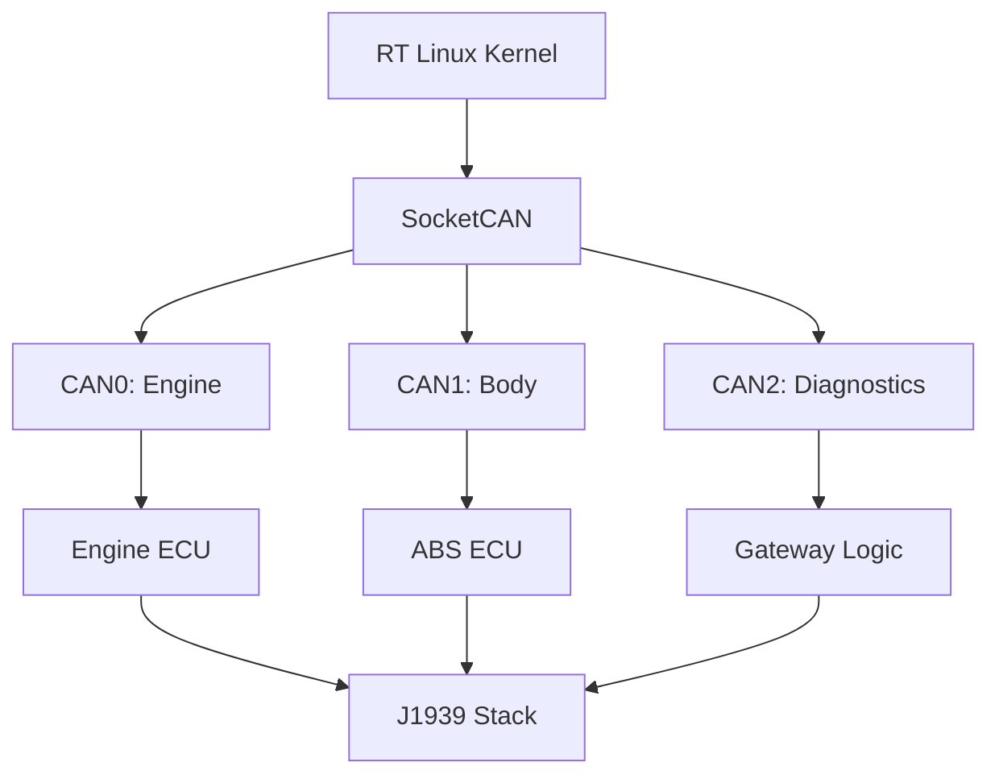

# Project 3: CAN-RT-Gateway 🚗⚡
## Advanced Level: Real-time CAN Bus ECU Simulation

[](https://github.com)
[](https://github.com)
[](https://github.com)

> **Real-time automotive ECU gateway with CAN bus communication and safety-critical system design**

## 🎯 Project Overview

**Description**: Develop a sophisticated automotive ECU simulation system with real-time CAN bus communication, demonstrating advanced RT kernel optimization, automotive protocols, and safety-critical system design.

**Learning Objectives**:
1. Master real-time Linux with PREEMPT_RT kernel
2. Implement CAN bus protocols (J1939, OBD-II) 
3. Create automotive ECU simulation framework
4. Design safety-critical systems with fault tolerance
5. Optimize performance for automotive timing requirements

## 🔧 Technical Specifications

### Hardware Stack
- **Target**: BeagleBone Black with MCP2515 CAN controller
- **Networks**: Multi-CAN setup (Engine, Body, Diagnostics)
- **Development**: Ubuntu 22.04 with RT kernel development tools
- **Testing**: CAN analyzer, oscilloscope for timing verification

### Software Architecture
```
RT Linux Kernel (PREEMPT_RT)
├── SocketCAN Framework
│   ├── Engine Management Network (CAN0)
│   ├── Body Electronics Network (CAN1)
│   └── Diagnostics Network (CAN2)
├── ECU Simulation Framework
│   ├── Engine ECU (Fuel, Ignition, RPM)
│   ├── ABS/ESC ECU (Safety systems)
│   └── Gateway Logic (Protocol translation)
├── Automotive Protocols
│   ├── J1939 Protocol Stack
│   ├── OBD-II/UDS Implementation
│   └── Network Management
└── Safety & Monitoring
    ├── Watchdog Services
    ├── Fault Detection/Recovery
    └── Performance Monitoring
```

## 🚀 Implementation Phases

### Phase 1: RT Kernel & CAN Setup (Weeks 1-2)
- Configure PREEMPT_RT kernel with <50μs latency
- Integrate MCP2515 CAN controllers
- Set up SocketCAN framework
- Implement basic CAN messaging

### Phase 2: ECU Simulation (Weeks 3-4)  
- Design modular ECU simulation architecture
- Implement realistic Engine Management ECU
- Create ABS/ESC safety system simulation
- Establish inter-ECU communication protocols

### Phase 3: Protocol Implementation (Week 5)
- Develop J1939 protocol stack
- Implement OBD-II diagnostic services
- Create network management functions
- Build gateway routing logic

### Phase 4: Safety & Testing (Weeks 6-7)
- Implement safety watchdog systems
- Create fault injection/recovery mechanisms
- Develop comprehensive testing framework
- Optimize performance and validate timing

### Phase 5: Documentation (Week 8)
- Professional documentation and diagrams
- Performance analysis and benchmarking
- Video demonstration and portfolio presentation

## 📋 Key Implementation Examples

### RT Kernel Configuration
```bash
# Critical RT kernel options
CONFIG_PREEMPT_RT=y
CONFIG_HIGH_RES_TIMERS=y
CONFIG_NO_HZ_FULL=y
CONFIG_CAN=y
CONFIG_CAN_MCP251X=y

# Performance optimization
echo 'KERNEL_FEATURES += "features/latency/latency.scc"' >> local.conf
```

### ECU Simulator Core
```c
class EngineECU {
    void cyclicTask() {
        struct timespec next_cycle;
        clock_gettime(CLOCK_MONOTONIC, &next_cycle);
        
        while(running) {
            updateEngineSimulation();
            sendCANMessages();     // RPM, throttle, temp
            processIncomingCAN();  // Commands, requests
            
            // Precise 10ms timing
            next_cycle.tv_nsec += 10000000;
            clock_nanosleep(CLOCK_MONOTONIC, TIMER_ABSTIME, &next_cycle, NULL);
        }
    }
    
    void sendEngineRPM() {
        struct can_frame frame;
        frame.can_id = 0x0C0;
        frame.data[0] = rpm & 0xFF;
        frame.data[1] = (rpm >> 8) & 0xFF;
        write(can_socket, &frame, sizeof(frame));
    }
};
```

### J1939 Protocol Implementation
```c
typedef struct {
    uint8_t priority;
    uint16_t pgn;        // Parameter Group Number
    uint8_t source_addr;
    uint8_t data[8];
} j1939_message_t;

void sendJ1939EngineData(uint16_t rpm, uint8_t torque) {
    j1939_message_t msg;
    msg.priority = 3;
    msg.pgn = 0xF004;    // Electronic Engine Controller 1
    msg.data[0] = torque;
    msg.data[2] = rpm & 0xFF;
    msg.data[3] = (rpm >> 8) & 0xFF;
    send(j1939_socket, &msg, sizeof(msg), 0);
}
```

## 📊 Performance Targets

- **RT Latency**: <50μs maximum, <10μs average
- **CAN Throughput**: 1000+ messages/second
- **ECU Response**: <5ms for safety-critical messages
- **System Resources**: <70% CPU, <256MB RAM
- **Boot Time**: <30 seconds to operational state

## 📚 Professional Documentation

### System Architecture Diagram


### LinkedIn Strategy
**Week 1**: "Diving into real-time Linux for automotive applications"
**Week 4**: "Building realistic ECU simulators with CAN bus integration"
**Week 6**: "Implementing safety-critical automotive protocols"
**Week 8**: "CAN-RT-Gateway project complete - lessons in automotive embedded systems"

### YouTube Demo (15 min)
1. **Introduction** (2 min): Real-time automotive requirements
2. **Architecture** (4 min): RT kernel and CAN network design
3. **Live Demo** (6 min): ECU simulation and message flow
4. **Performance** (2 min): Timing analysis and benchmarks
5. **Industry Impact** (1 min): Career relevance and next steps

## 🎖️ Professional Impact

### Resume Enhancement
```
REAL-TIME AUTOMOTIVE ECU GATEWAY SYSTEM                         2024
• Developed real-time ECU simulation with RT Linux achieving <50μs latency guarantees
• Implemented multi-network CAN bus gateway supporting J1939/OBD-II protocols  
• Created safety-critical automotive systems with fault tolerance and watchdog services
• Optimized performance for 1000+ messages/second with automotive timing compliance
• Technologies: RT Linux, SocketCAN, J1939, OBD-II, BeagleBone Black, automotive protocols
```

### Skills Demonstrated
- Real-time system design and optimization
- Automotive protocol expertise (CAN, J1939, OBD-II)
- Safety-critical system development
- Performance engineering and timing analysis
- Professional embedded development practices

---

> **Next Project**: [AV-Edge-Fusion Expert Platform](../04_expert_av_platform/) - Autonomous vehicle edge computing with AI/ML integration

### 🏷️ Tags
`#RealTimeLinux` `#CANBus` `#AutomotiveECU` `#J1939` `#OBDII` `#SafetyCritical` `#EmbeddedLinux` `#RTSystems` `#AutomotiveEngineering` `#YoctoProject` 