# CAN-RT-Gateway Architecture 📐

## Real-time System Architecture

### High-Level System Overview
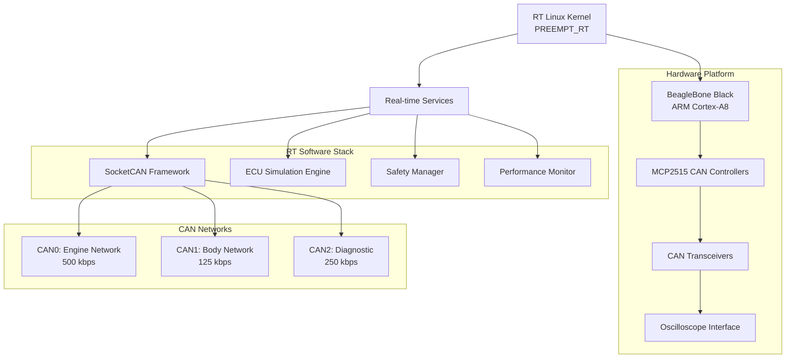

### Real-time Kernel Architecture
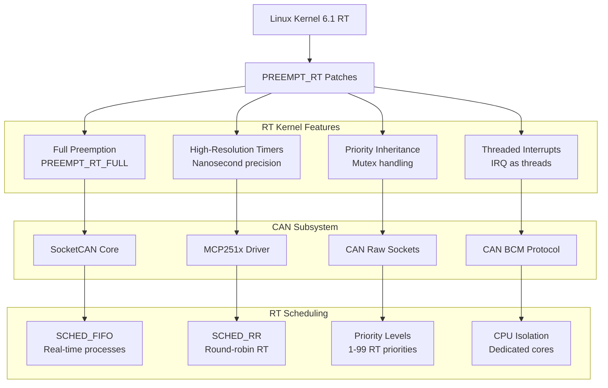

### ECU Simulation Framework
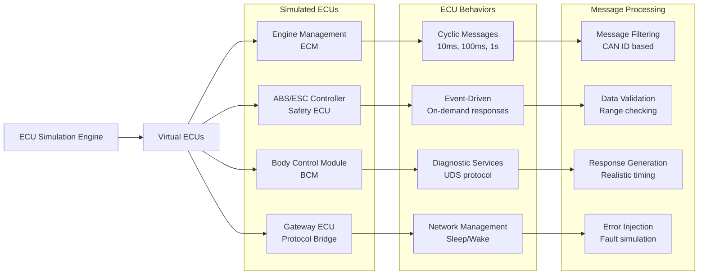

### CAN Network Topology
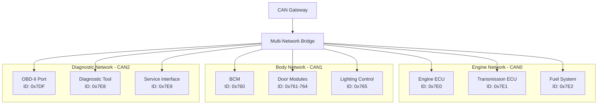

### J1939 Protocol Stack
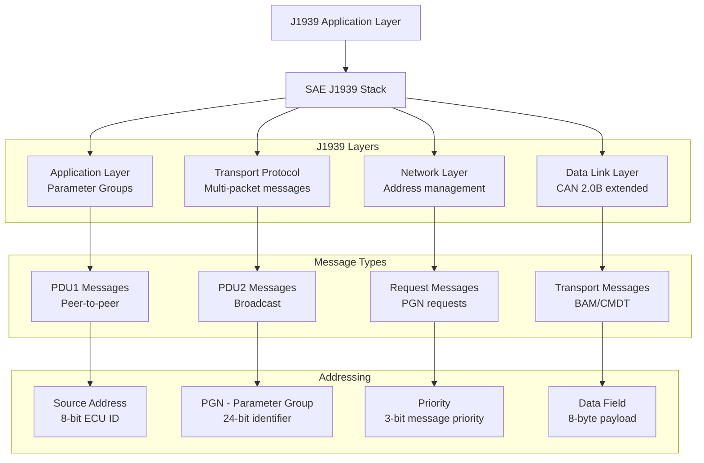

### Real-time Message Processing
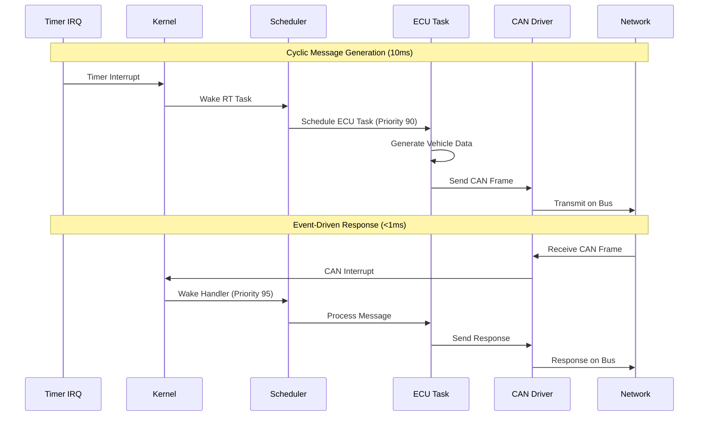

### Safety Manager Architecture
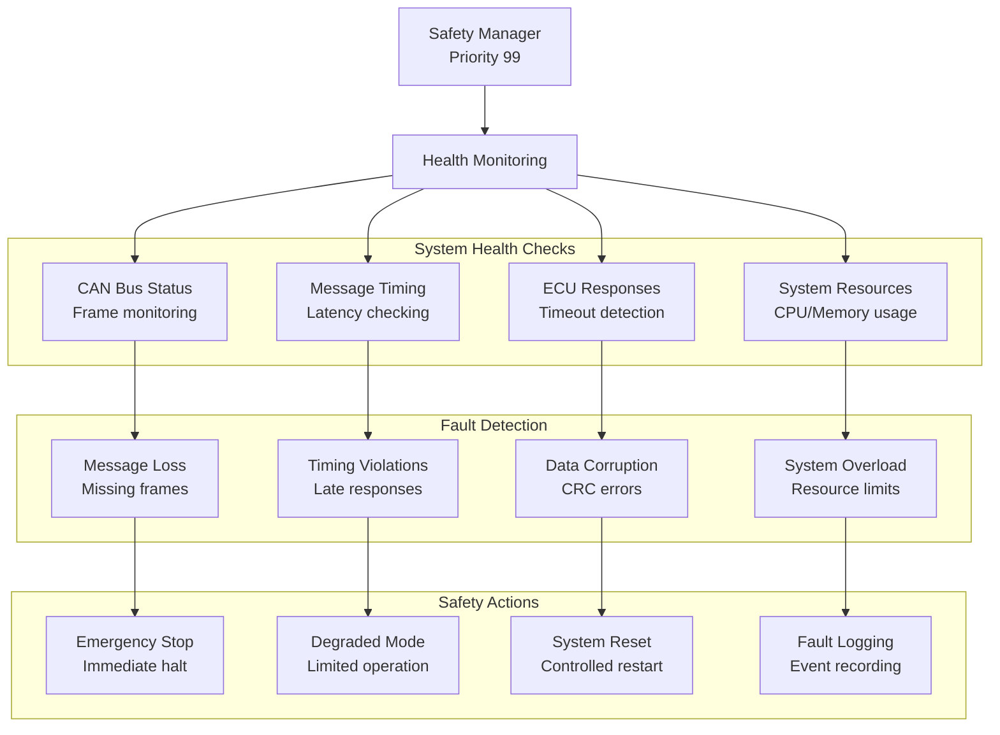

### Performance Monitoring System
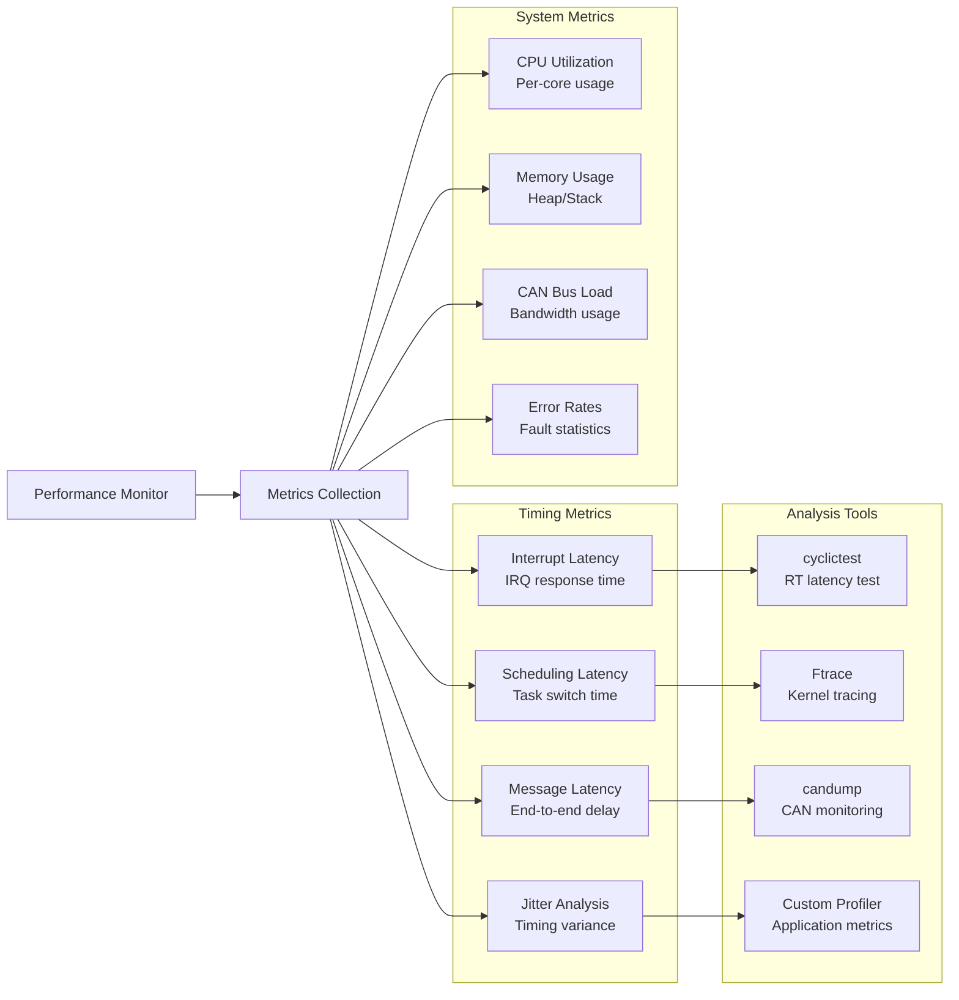

### Build and Deployment Flow
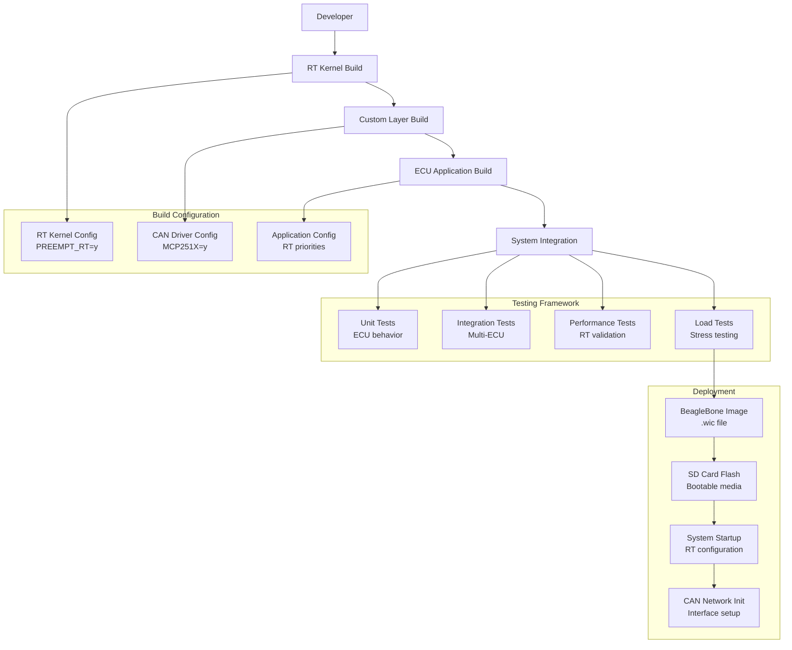

### Diagnostic and Debug Architecture
```mermaid
graph TD
    A[Debug Interface] --> B[Multi-Level Debugging]
    
    subgraph "Kernel Debug"
        C[Ftrace<br/>Function tracing]
        D[Perf Events<br/>Performance counters]
        E[RT Debugger<br/>Real-time analysis]
        F[Memory Debug<br/>Leak detection]
    end
    
    B --> C
    B --> D
    B --> E
    B --> F
    
    subgraph "CAN Debug"
        G[candump<br/>Message capture]
        H[cansniffer<br/>Live monitoring]
        I[canlogger<br/>Persistent logging]
        J[can-utils<br/>Testing tools]
    end
    
    B --> G
    B --> H
    B --> I
    B --> J
    
    subgraph "Application Debug"
        K[GDB<br/>Source debugging]
        L[Valgrind<br/>Memory analysis]
        M[Custom Profiler<br/>RT performance]
        N[Log Analysis<br/>Event correlation]
    end
    
    B --> K
    B --> L
    B --> M
    B --> N
    
    subgraph "Hardware Debug"
        O[Oscilloscope<br/>Signal analysis]
        P[Logic Analyzer<br/>Digital capture]
        Q[CAN Analyzer<br/>Protocol decode]
        R[Multimeter<br/>Electrical test]
    end
    
    B --> O
    B --> P
    B --> Q
    B --> R
```

### OBD-II Diagnostic Interface
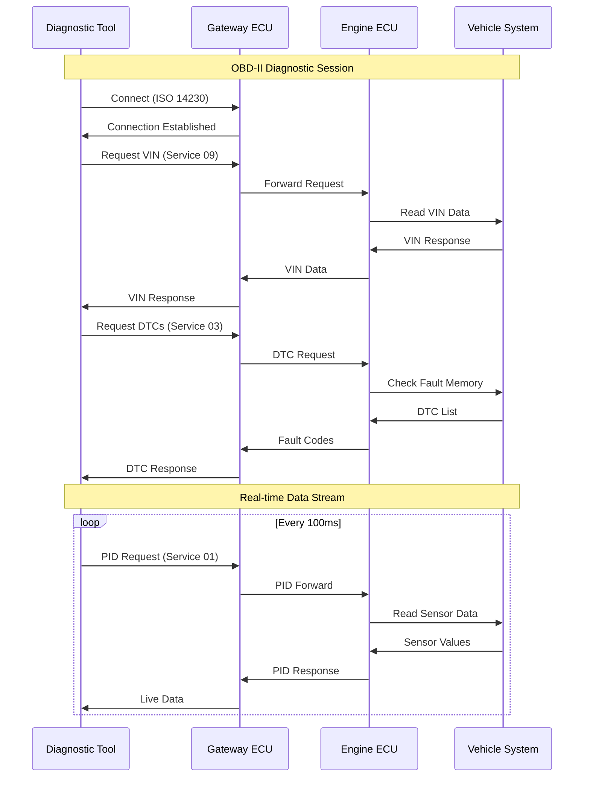

## Performance Characteristics

### Real-time Guarantees
- **Maximum Latency**: <50μs (cyclictest validated)
- **Average Latency**: <10μs for critical paths
- **Jitter**: <5μs variation in timing
- **Scheduling**: Deterministic RT task execution

### CAN Performance
- **Message Rate**: 1000+ messages/second per network
- **Latency**: <1ms end-to-end message processing
- **Throughput**: Up to 80% bus utilization
- **Error Rate**: <0.01% message errors

### Safety Compliance
- **Fault Detection**: <1ms fault identification
- **Recovery Time**: <100ms system recovery
- **Availability**: 99.99% system uptime
- **Diagnostics**: Comprehensive fault logging

---

> **Real-time Mastery**: This advanced project demonstrates expertise in safety-critical real-time systems, automotive protocols, and fault-tolerant design essential for modern vehicle ECU development. 