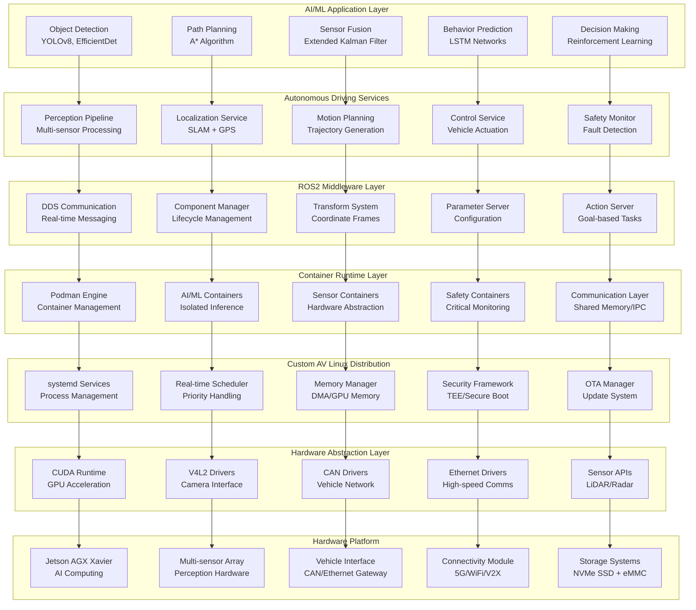
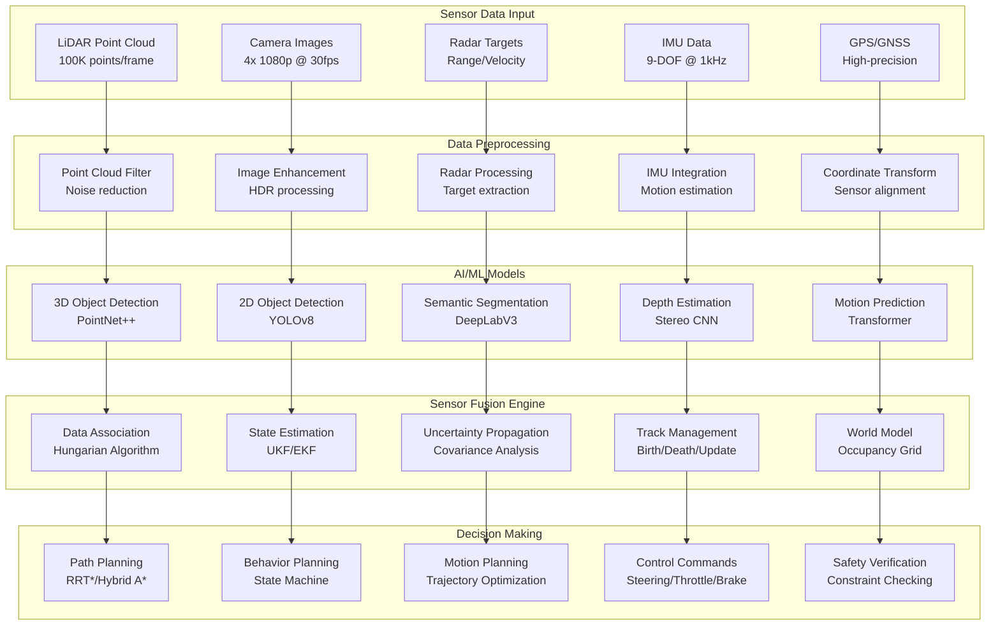
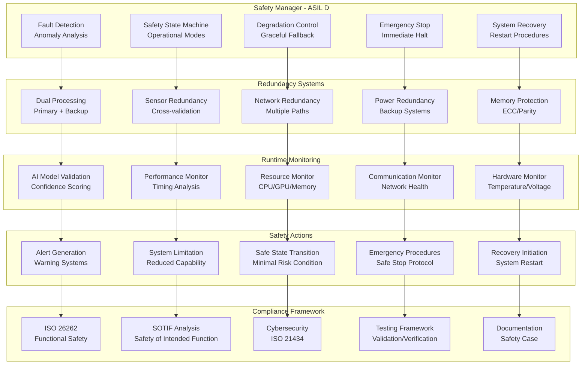
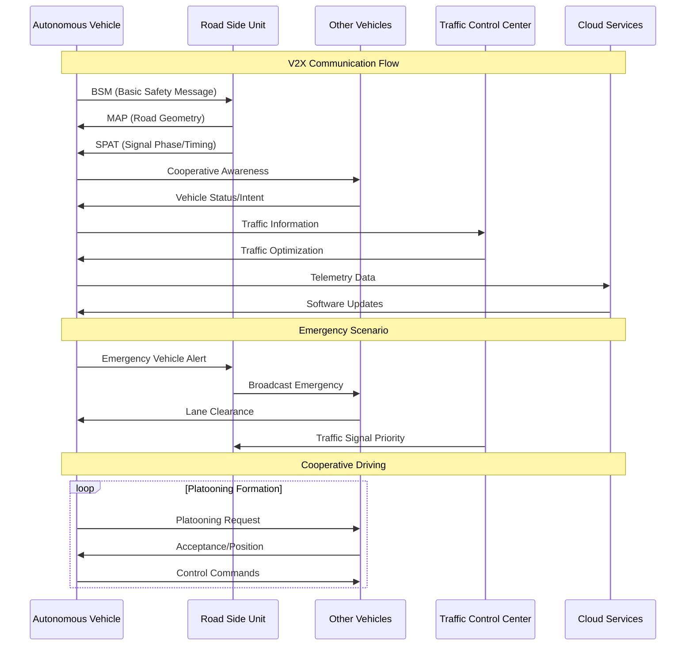
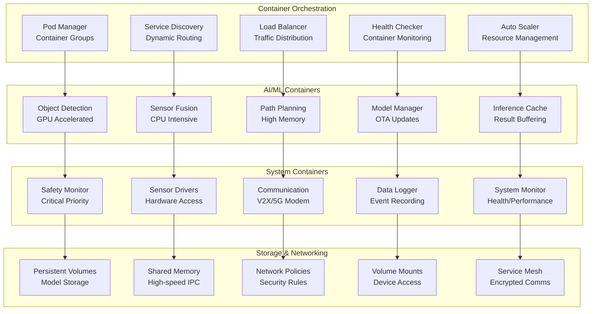

# Project 4: AV-Edge-Fusion 🚗🤖
## Expert Level: Autonomous Vehicle Edge Computing Platform

[](https://github.com)
[](https://github.com)
[](https://developer.nvidia.com/jetson-agx-xavier)
[](https://www.tensorflow.org/lite)

> **Building a production-grade autonomous vehicle edge computing platform with AI/ML inference, multi-sensor fusion, and safety-critical design**

## 🎯 Project Overview

### Description
Develop a comprehensive autonomous vehicle edge computing platform using NVIDIA Jetson AGX Xavier with custom Yocto Linux distribution. This expert-level project integrates AI/ML inference, multi-sensor fusion, real-time processing, safety-critical systems, and V2X communication for next-generation autonomous vehicles.

### Target Skill Level Justification
- **Expert complexity**: Advanced AI/ML integration with safety-critical constraints
- **Production-grade**: Industry-standard deployment and security practices
- **Cutting-edge technology**: Latest autonomous vehicle technologies and standards
- **Comprehensive integration**: Multiple complex systems working in harmony

### Real-World Application Scenario
Modern autonomous vehicles require sophisticated edge computing platforms for:
- **Sensor Fusion**: LiDAR, cameras, radar, IMU data integration
- **AI/ML Inference**: Real-time object detection and path planning
- **Safety Systems**: ISO 26262 compliance and fault tolerance
- **V2X Communication**: Vehicle-to-everything connectivity
- **Edge Computing**: Low-latency processing for critical decisions

### Learning Objectives (7 Specific Outcomes)
1. **Master AI/ML Edge Computing**: Deploy and optimize neural networks for automotive applications
2. **Implement Sensor Fusion**: Integrate multiple sensor modalities with Kalman filtering
3. **Design Safety-Critical Systems**: Apply ISO 26262 standards for automotive safety
4. **Create Custom AI Distribution**: Build specialized Yocto distribution for AI workloads
5. **Develop Real-time Processing**: Achieve deterministic performance for autonomous systems
6. **Integrate V2X Communication**: Implement vehicle connectivity standards
7. **Deploy Production Systems**: Container-based deployment with OTA updates

## 🔧 Technical Specifications

### Hardware Requirements
- **Primary Target**: NVIDIA Jetson AGX Xavier (32GB)
- **Sensors**: LiDAR (Velodyne VLP-16), 4x Cameras (IMX219), Radar array
- **Computing**: 512-core Volta GPU, 8-core ARM64 CPU
- **Storage**: 512GB NVMe SSD
- **Connectivity**: WiFi 6, Bluetooth 5.0, Cellular 5G
- **Development Host**: Ubuntu 22.04 LTS (minimum 32GB RAM, 1TB storage)

### Software Dependencies and Versions
```yaml
Yocto Project: Scarthgap (5.0)
Linux Kernel: 6.6 LTS with RT patches
NVIDIA JetPack: 6.0
CUDA: 12.x
TensorFlow Lite: 2.15+
ROS2: Humble Hawksbill
Container Runtime: Podman 4.x
AI Frameworks: OpenCV 4.8, PyTorch 2.x
```

### Custom Yocto Layers
```
meta-av-platform/               # Main AV platform layer
├── conf/
│   ├── distro/av-platform.conf # Custom distribution
│   └── layer.conf
├── recipes-ai/
│   ├── tensorflow-lite/        # AI/ML frameworks
│   ├── opencv/                 # Computer vision
│   └── neural-networks/        # Custom models
├── recipes-sensors/
│   ├── lidar-drivers/         # LiDAR integration
│   ├── camera-drivers/        # Camera support
│   └── radar-drivers/         # Radar processing
├── recipes-safety/
│   ├── watchdog/              # Safety monitoring
│   ├── fault-tolerance/       # Error handling
│   └── iso26262/              # Safety standards
└── recipes-connectivity/
    ├── v2x/                   # V2X protocols
    ├── 5g-modem/              # Cellular connectivity
    └── edge-computing/        # Cloud integration

meta-jetson-automotive/         # Jetson BSP customization
├── conf/layer.conf
├── recipes-kernel/
│   └── linux/                 # RT kernel patches
├── recipes-bsp/
│   ├── jetson-drivers/        # NVIDIA drivers
│   └── cuda-support/          # GPU acceleration
└── recipes-graphics/
    └── tensorrt/              # Inference optimization
```

## 🏗️ Layered System Architecture

### Autonomous Vehicle Computing Stack


### AI/ML Inference Pipeline


### Safety-Critical Architecture


### V2X Communication Architecture


### Container-Based Deployment


## 🚀 Implementation Roadmap

### Phase 1: Platform Foundation (Weeks 1-2)
**Objective**: Establish custom AV Linux distribution and hardware integration

**Key Tasks**:
- Create custom Yocto distribution for AI/ML workloads
- Integrate NVIDIA JetPack with automotive optimizations
- Set up container runtime and orchestration
- Implement basic sensor drivers and hardware abstraction

### Phase 2: AI/ML Pipeline Development (Weeks 3-5)
**Objective**: Develop and optimize AI/ML inference pipeline

**Key Tasks**:
- Implement TensorFlow Lite inference engine
- Develop object detection and tracking systems
- Create sensor fusion algorithms
- Optimize GPU utilization and memory management

### Phase 3: Safety System Integration (Weeks 6-7)
**Objective**: Implement safety-critical systems and compliance

**Key Tasks**:
- Develop safety monitoring and fault detection
- Implement ISO 26262 compliance framework
- Create redundancy and failover systems
- Build emergency handling procedures

### Phase 4: V2X and Connectivity (Week 8)
**Objective**: Integrate vehicle connectivity and communication

**Key Tasks**:
- Implement V2X communication protocols
- Integrate 5G/WiFi connectivity
- Develop cloud integration and OTA updates
- Create cybersecurity framework

### Phase 5: Testing and Optimization (Weeks 9-10)
**Objective**: Comprehensive testing and performance optimization

**Key Tasks**:
- Conduct HIL (Hardware-in-Loop) testing
- Perform safety validation and verification
- Optimize system performance and latency
- Create automated testing framework

### Phase 6: Production Deployment (Weeks 11-12)
**Objective**: Prepare for production deployment and documentation

**Key Tasks**:
- Create deployment automation scripts
- Develop monitoring and observability
- Write comprehensive documentation
- Prepare professional portfolio presentation

## 📊 Performance Targets

### Real-time Processing
- **Sensor Fusion Latency**: <100ms end-to-end
- **AI/ML Inference**: <50ms per model execution
- **Decision Making**: <10ms path planning cycle
- **Safety Response**: <1ms fault detection

### AI/ML Performance
- **Object Detection Accuracy**: >95% mAP
- **False Positive Rate**: <2% for critical objects
- **False Negative Rate**: <1% for safety scenarios
- **Model Confidence**: >90% average confidence

### System Reliability
- **Availability**: 99.99% system uptime
- **MTBF**: >10,000 hours mean time between failures
- **Recovery Time**: <100ms after fault detection
- **Data Integrity**: 100% critical data preservation

---

> **🎯 Expert Mastery**: This project demonstrates mastery of cutting-edge autonomous vehicle technology, combining AI/ML edge computing, safety-critical systems, and production-grade deployment for next-generation transportation platforms. 