# AV-Edge-Fusion Architecture 📐

## Autonomous Vehicle Edge Computing Platform

### System Overview

```mermaid
graph TB
    A[NVIDIA Jetson AGX Xavier] --> B[Multi-Sensor Array]
    
    subgraph "Sensors"
        C[LiDAR 360°]
        D[Cameras x4]
        E[Radar Array]
        F[IMU + GPS]
    end
    
    B --> C
    B --> D
    B --> E
    B --> F
    
    subgraph "Edge Computing"
        G[Custom Yocto Linux]
        H[AI/ML Pipeline]
        I[ROS2 Middleware]
        J[Safety Manager]
    end
    
    A --> G
    G --> H
    G --> I
    G --> J
    
    subgraph "Vehicle Integration"
        K[CAN Bus Gateway]
        L[V2X Communication]
        M[Cloud Connectivity]
    end
    
    I --> K
    I --> L
    I --> M
```

### AI/ML Processing Pipeline

### Real-time Processing Flow

### Safety Architecture

### Container Deployment

### Multi-Core Optimization

### V2X Communication

### OTA Update System

### Performance Monitoring

## Key Performance Targets

### Real-time Processing
- **Sensor Fusion**: <100ms end-to-end
- **AI/ML Inference**: <50ms per model
- **Path Planning**: <10ms cycle time
- **Safety Response**: <1ms fault detection

### AI/ML Performance
- **Object Detection**: >95% mAP accuracy
- **False Positive**: <2% for critical objects
- **False Negative**: <1% for safety scenarios
- **Model Confidence**: >90% average

### System Reliability
- **Availability**: 99.99% uptime
- **Recovery Time**: <100ms fault recovery
- **Resource Usage**: <70% CPU, <85% GPU
- **Power Budget**: <200W total consumption

---

> **Autonomous Excellence**: This expert project demonstrates cutting-edge autonomous vehicle technology with AI/ML edge computing, safety-critical design, and production-ready deployment for next-generation transportation systems. 