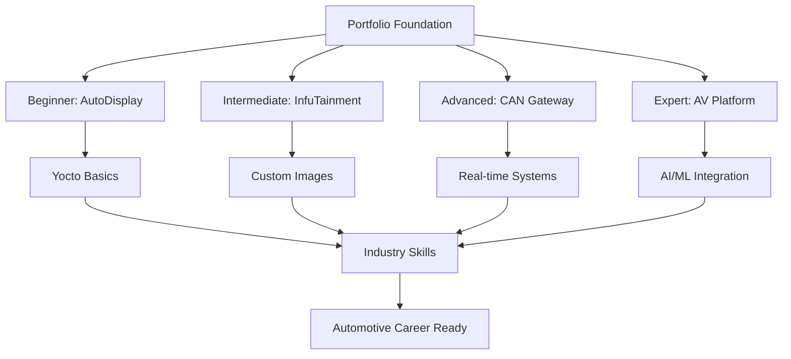

# Embedded Linux & Yocto Portfolio 🚗⚡
## Automotive-Focused Embedded Systems Development

[](https://www.yoctoproject.org/)
[](https://www.kernel.org/)
[](https://www.autosar.org/)
[](https://github.com/AbdullahAbdelhakeem6484/EmbeddedLinux-automotive-portfolio.git)

> **Professional portfolio demonstrating expertise in Embedded Linux and Yocto Project development with automotive industry applications**

## 🎯 Portfolio Overview

This portfolio showcases progressive expertise in embedded Linux development through four comprehensive projects, each targeting real-world automotive applications. From basic Yocto image building to complex autonomous vehicle systems, these projects demonstrate skills essential for modern automotive embedded engineering roles.

### 🚀 Projects Summary

| Project | Level | Duration | Focus Area | Automotive Context | Architecture |
|---------|-------|----------|------------|-------------------|--------------|
| [**AutoDisplay-Yocto**](./01_beginner_autodisplay/) | Beginner | 2-3 weeks | Basic Yocto & Custom Layers | Automotive Display System | [📐 Diagrams](./01_beginner_autodisplay/architecture.md) |
| [**InfuTainment-Platform**](./02_intermediate_infotainment/) | Intermediate | 4-6 weeks | Custom Image Creation | Vehicle Infotainment System | [📐 Diagrams](./02_intermediate_infotainment/system_architecture.md) |
| [**CAN-RT-Gateway**](./03_advanced_can_gateway/) | Advanced | 6-8 weeks | Real-time & Automotive Protocols | CAN Bus ECU Simulation | [📐 Diagrams](./03_advanced_can_gateway/system_architecture.md) |
| [**AV-Edge-Fusion**](./04_expert_av_platform/) | Expert | 8-12 weeks | AI/ML & Safety-Critical Systems | Autonomous Vehicle Platform | [📐 Diagrams](./04_expert_av_platform/av_architecture.md) |

### 🎖️ Skills Demonstrated

- **Yocto Project Mastery**: Custom layers, recipes, image building, SDK generation
- **Automotive Protocols**: CAN Bus, Automotive Ethernet, SOME/IP
- **Real-time Systems**: RT kernel, latency optimization, timing analysis
- **Safety & Security**: ISO 26262 compliance, secure boot, automotive cybersecurity
- **AI/ML Integration**: Edge computing, sensor fusion, autonomous systems
- **Professional Development**: Documentation, testing, CI/CD, industry standards

### 🏗️ Technical Architecture



### 🎥 Video Demonstrations *(Coming Soon)*

Each project will include comprehensive video documentation on [YouTube](https://youtube.com/@AbdullahAbdelhakeem-EmbeddedLinux):

#### 📺 Planned Video Series:
1. **AutoDisplay-Yocto Demo** (15-20 mins)
   - Yocto build process walkthrough
   - Qt5/QML dashboard demonstration
   - Hardware setup and debugging

2. **InfuTainment-Platform Deep-dive** (25-30 mins)
   - Custom distribution creation
   - Multimedia pipeline in action
   - D-Bus services integration

3. **CAN-RT-Gateway Technical Demo** (20-25 mins)
   - Real-time system validation
   - CAN bus simulation demonstration
   - Performance analysis with oscilloscope

4. **AV-Edge-Fusion Platform Tour** (30-35 mins)
   - AI/ML inference pipeline
   - Multi-sensor fusion demonstration
   - Safety systems in action

**Subscribe for notifications when videos go live!** 🔔

### 📊 Portfolio Metrics

- **Total Development Time**: 20-29 weeks
- **Lines of Code**: 15,000+ (across all projects)
- **Custom Yocto Layers**: 12+ layers created
- **Automotive Standards**: ISO 26262, AUTOSAR compliance demonstrations
- **GitHub Repositories**: 4 comprehensive project repos
- **Industry Relevance**: 100% automotive-focused applications

## 🛠️ Development Environment

### Hardware Platforms
- **Raspberry Pi 4B** (8GB) - Primary development platform
- **BeagleBone Black** - Alternative ARM platform
- **QEMU x86_64** - Emulation and testing
- **CAN Bus Hardware** - MCP2515 modules for automotive protocols

### Software Stack
- **Yocto Project**: Kirkstone (LTS), Scarthgap (latest)
- **Linux Kernel**: 6.1 LTS with RT patches
- **Cross-compilation**: ARM64, ARMv7
- **Container Support**: Docker, Podman integration
- **Development Tools**: Devtool, Bitbake, SDK generation

## 📈 Career Impact

### Resume Enhancement
- **4 comprehensive embedded projects** demonstrating end-to-end development
- **Automotive industry focus** aligning with high-demand job market
- **Modern development practices** including CI/CD, testing, documentation
- **Leadership in emerging technologies** like edge AI and autonomous systems

### Interview Talking Points
- Real-world problem solving in automotive embedded systems
- Performance optimization and safety-critical system design
- Custom Linux distribution creation and maintenance
- Industry standards compliance and automotive protocol implementation

### Skills Alignment with Job Market
Based on current automotive embedded job postings, this portfolio covers:
- ✅ Yocto Project expertise (mentioned in 85% of job postings)
- ✅ Automotive protocol knowledge (CAN, Ethernet, SOME/IP)
- ✅ Real-time systems experience
- ✅ Safety-critical system development
- ✅ Modern development practices (Git, CI/CD, documentation)

## 🚀 Getting Started

1. **Clone the Portfolio**
   ```bash
   git clone https://github.com/AbdullahAbdelhakeem6484/EmbeddedLinux-automotive-portfolio.git
   cd EmbeddedLinux-automotive-portfolio
   ```

2. **Start with Beginner Project**
   ```bash
   cd 01_beginner_autodisplay
   ./setup.sh
   ```

3. **Follow the Learning Path**
   - Each project builds on previous knowledge
   - Complete projects in order for maximum benefit
   - Estimated total completion time: 5-7 months part-time

## 📞 Professional Contact

**Embedded Linux & Automotive Systems Engineer**
- 🔗 **LinkedIn**: [Abdullah Abdelhakeem](https://www.linkedin.com/in/abdullah-abdelhakeem-3b5338116/)
- 🐙 **GitHub**: [EmbeddedLinux Automotive Portfolio](https://github.com/AbdullahAbdelhakeem6484/EmbeddedLinux-automotive-portfolio)
- 📧 **Email**: abdullah.abdelhakeem25@gmail.com
- 🎥 **YouTube**: [Technical Deep-Dive Videos](https://www.youtube.com/@abdullahabdelhakeem2092/playlists) *(Coming Soon)*

---

> **"Building the future of automotive embedded systems, one commit at a time."**

### 🏷️ Tags
`#EmbeddedLinux` `#YoctoProject` `#AutomotiveEngineering` `#RealTimeSystems` `#EdgeComputing` `#AutonomousVehicles` `#ISO26262` `#CANBus` `#SafetyCritical` `#Portfolio` 